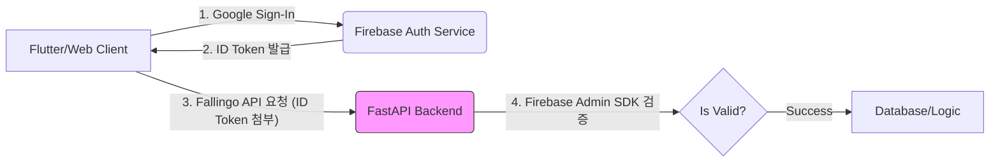

안녕하세요, Fallingo 개발자 Su입니다! 🙋‍♂️

2026년 1월 28일은 정말 많은 일이 일어난 날이었습니다. 그동안 기능별로 분리해서 작업하던 브랜치들을 메인 브랜치에 병합하고, 사용자 경험(UX) 관점에서 미흡했던 부분들을 긴급 수정하는 작업이 집중되었습니다.

이번 개발 일지는 복잡하게 얽혀 있던 인증 로직을 깔끔하게 정리하고, 사용자 온보딩 경험을 개선하는 데 초점을 맞췄던 11개의 커밋 내용을 정리해 보겠습니다.

---

## 📝 이번 기간 작업 내용 (66972de..b206d37)

이번 기간에는 총 11개의 커밋이 발생했으며, 크게 **인증 시스템 통합**, **사용자 온보딩 UX 개선**, **이벤트 알림 시스템 구축** 세 가지 영역으로 그룹화할 수 있습니다.

### 1. 인증 시스템 통합 및 리팩토링 (Authentication Refactoring)

Fallingo는 웹과 모바일 앱(Flutter 기반)을 동시에 지원해야 하므로, 인증 방식 통일이 중요한 과제였습니다. 초기에는 웹에서 Google Access Token을 직접 받아 백엔드(FastAPI)에서 검증하는 복잡한 구조를 시도했지만, 결국 Firebase Authentication으로 완전히 통일하는 방향으로 리팩토링을 진행했습니다.

| 커밋 내용 | 설명 |
| :--- | :--- |
| `feat`: 웹 Google Sign-In 지원 (Access Token) | 웹 초기 구현 시도 (Access Token 방식) |
| `refactor`: Google OAuth 직접 검증 제거 및 Firebase Auth로 통일 | 보안 및 관리 편의성을 위해 Firebase 기반으로 통일 🧹 |
| `refactor`: 메인 브랜치 병합 후 Google Access Token 지원 제거 | 잔여 레거시 코드 제거 및 클린업 |

**결과:** Google OAuth와 Firebase Auth 로직이 이중으로 관리되던 문제를 해결하고, 모든 인증을 Firebase ID Token 기반으로 통합하여 백엔드 검증 로직을 단순화했습니다. 이는 Flutter와 FastAPI 연동 시 API 엔드포인트의 일관성을 확보하는 데 결정적인 역할을 했습니다.

### 2. 사용자 온보딩 UX 개선 (Permissions Flow Improvement)

위치 기반 플랫폼인 Fallingo 특성상 다양한 권한(위치, 사진첩, 블루투스 등) 요청이 필수적입니다. 하지만 불필요한 마찰을 줄이기 위해 필수 권한과 선택 권한을 명확히 분리하고, 권한 거부 시 사용자 가이드 플로우를 개선했습니다.

| 커밋 내용 | 설명 |
| :--- | :--- |
| `feat`: 회원가입 권한 요청 개선 (블루투스 추가 + 설정 이동) | 권한 거부 시, 앱 설정으로 이동하도록 UX 개선 |
| `fix`: 회원가입 시 블루투스 권한을 선택으로 변경 | **중요:** 블루투스 기능은 부가적임을 인지하고 필수 항목에서 제외 (UX Critical Fix) |
| `chore`: 권한 안내 UI에 사진첩 권한 추가 및 다국어 파일 업데이트 | 온보딩 UI 전반적인 업데이트 및 i18n 지원 |

**결과:** 필수 권한이 아니었던 블루투스를 선택 권한으로 변경함으로써, 사용자가 초기 가입 시 느끼는 심리적 장벽을 낮췄습니다. 필수 권한 요구사항은 이제 [위치]와 [사진첩]으로 최소화되었습니다.

### 3. 이벤트 알림 시스템 구현 및 병합 (Notification System)

미래의 '월드 이벤트'나 'OCR 마일스톤 달성' 같은 내부 이벤트를 사용자에게 푸시 알림으로 전달하기 위한 기본 시스템을 구축했습니다.

| 커밋 내용 | 설명 |
| :--- | :--- |
| `feat`: 이벤트 알림 시스템 구현 (월드 이벤트 + OCR 마일스톤) | 백엔드 트리거와 프론트엔드 알림 렌더링 로직 구현 |
| `Merge pull request #37`: feature/event-notification-system | 해당 기능을 메인 브랜치에 최종 병합 |

## 💡 작업 하이라이트: "인증 방식 통일은 언제나 옳다"

이번 기간의 가장 큰 승리는 **Google OAuth 직접 검증 로직을 제거**하고 Firebase Auth로 완전히 통일한 것입니다.

초기 계획은 웹에서 직접 받은 Google Access Token을 FastAPI 백엔드가 Google API를 통해 다시 검증하는 복잡한 방식이었습니다. 하지만 이는 다음 문제들을 야기했습니다:

1.  **관리 복잡성:** 모바일(Flutter)은 Firebase ID Token을 쓰고, 웹은 Google Access Token을 쓰는 이원화된 구조.
2.  **보안 위험:** Access Token 만료 및 갱신 처리가 까다로움.
3.  **지연 시간:** API 호출이 한 단계 추가되어 지연 시간이 발생.

이 모든 문제를 해결하고, 백엔드는 오직 `Firebase Admin SDK`를 통해 검증된 ID Token만 받는 구조로 변경했습니다. 코드가 대폭 줄었고, 보안적으로도 안정성이 높아졌습니다.

### 🔁 반복된 `refactor`와 `merge`의 이유

1월 28일에 11개의 커밋이 집중된 이유는, 개발 초기 단계에서 다양한 기능 브랜치가 동시에 진행되었고, 특히 인증 및 권한처럼 앱의 기반이 되는 로직들이 여러 브랜치에서 겹쳤기 때문입니다. 기능을 병합(Merge)한 후, 기존의 모바일 중심 로직과 새로 추가된 웹 로직 간의 충돌을 해결하기 위해 `refactor`와 `fix` 커밋이 연이어 발생했습니다. 이는 큰 기능 통합 시 발생하는 자연스러운 현상이며, 이제 기반 구조가 훨씬 단단해졌다고 생각합니다. 💪

## 📊 개발 현황

현재 Fallingo 프로젝트는 2025년 12월 베타 런칭 목표를 향해 순조롭게 진행 중입니다.

| 영역 | 진행도 (예상) | 코멘트 |
| :--- | :--- | :--- |
| **핵심 백엔드 (FastAPI/PostgreSQL)** | 65% | 인증 통합 완료. 위치 기반 매칭 알고리즘 튜닝 중. |
| **모바일 프론트엔드 (Flutter)** | 70% | 주요 화면 UI/UX 구현 완료. 권한 및 알림 처리 로직 안정화. |
| **인프라/운영 (Google Cloud)** | 85% | Google for Startups 크레딧($2,000)을 활용해 초기 인프라 구축 완료. CI/CD 파이프라인 정비 중. |

다음 기간에는 위치 기반 추천 알고리즘을 개선하고, 비전공자 출신으로서 새롭게 배우고 있는 PostgreSQL 최적화 작업에 집중할 계획입니다.

개발 과정에서 겪는 어려움과 배움을 솔직하게 공유할 수 있도록 노력하겠습니다. 읽어주셔서 감사합니다! 😊