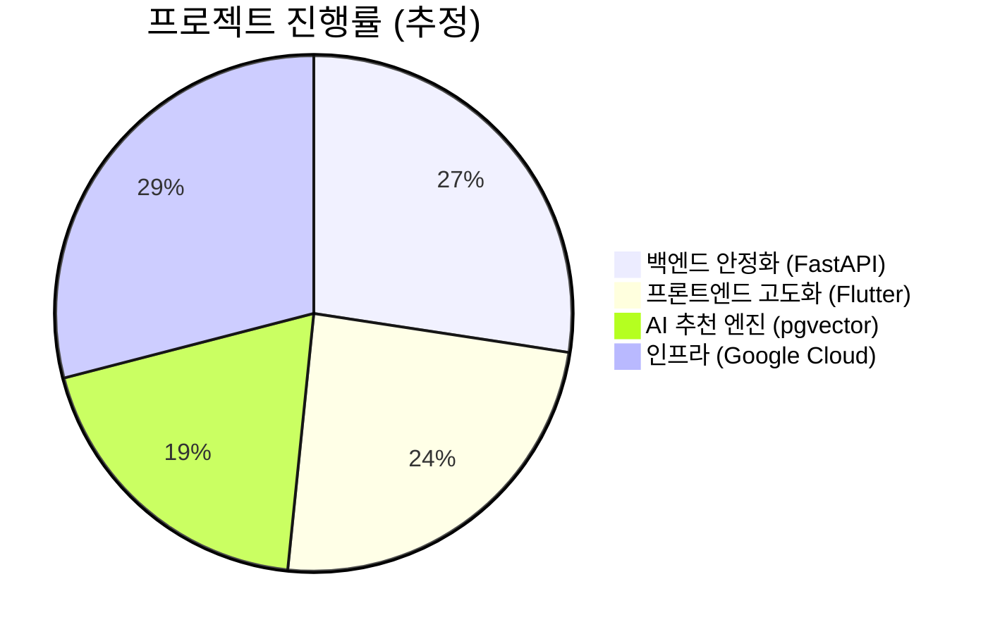

# fallingo 개발일지 - 510cb71..77ecbc0 (10개 커밋)

안녕하세요, Su입니다! 2025년 12월 베타 런칭 이후, 프로젝트의 내실을 다지고 기술 부채를 해결하며 한 걸음 더 나아가고 있습니다. 이번 2월 9일부터 10일까지 이틀간은 주로 **시스템의 의존성을 최신화**하고, 업데이트 후 발생한 변화들을 코드에 반영하는 작업을 진행했습니다.

개발자라면 누구나 공감하시겠지만, '패키지 업데이트'는 설레면서도 참 조심스러운 작업이죠. 이번 기간에는 어떤 변화가 있었는지 기록해 봅니다. 🚀

**작업 기간**: 2026-02-09 ~ 2026-02-10

---

## 📝 이번 기간 작업 내용

이번 커밋들은 크게 **의존성 관리**, **안정성 검증**, **정보 업데이트** 세 가지 영역으로 나눌 수 있습니다.

### 1. 전방위적 의존성 업데이트 (Dependency Management)
프로젝트의 뼈대를 이루는 주요 라이브러리들을 대거 업데이트했습니다. 특히 Flutter와 FastAPI 양쪽 모두에서 중요한 업데이트가 있었습니다.

| 영역 | 주요 업데이트 패키지 | 비고 |
| :--- | :--- | :--- |
| **Frontend** | `flutter_riverpod`, `freezed`, `go_router (15.1→17.1)` | 상태 관리 및 라우팅 엔진 최신화 |
| **Backend** | `pgvector (0.3.6→0.4.2)`, `development group` 4개 패키지 | AI 기반 벡터 검색 엔진 강화 |
| **Automation** | `Dependabot` PR 병합 (4건) | 보안 및 마이너 버전 자동 업데이트 |

### 2. 테스트 및 안정성 확보 (Testing & Stability)
패키지 버전을 올린 후에는 반드시 기존 기능이 망가지지 않았는지 확인해야 합니다.
- **테스트 코드 수정 및 확인**: 의존성 업데이트 후 발생한 사소한 브레이킹 체인지들을 수정하고 전체 테스트를 통과시켰습니다.
  - **Backend**: 436개 테스트 통과 (Passed) ✅
  - **Frontend**: 31개 테스트 통과 (Passed) ✅

### 3. 프로젝트 메타데이터 업데이트 (Documentation)
프로젝트의 규모가 커짐에 따라 'About' 페이지에 표시되는 수치들을 최신화했습니다.
- **서비스 규모 반영**: DB 모델 수(63→75개) 및 서비스 모듈 수(100→107개) 업데이트.
- 프로젝트가 얼마나 견고하게 성장하고 있는지 시각적으로 보여주는 지표입니다.

---

## 💡 작업 하이라이트

### 🔍 벡터 검색 엔진 `pgvector` 업데이트
Fallingo의 핵심 기능 중 하나는 사용자 위치와 취향을 기반으로 한 음식점 추천입니다. 이를 위해 PostgreSQL의 `pgvector`를 사용하고 있는데요. 이번에 `0.3.6`에서 `0.4.2`로 버전을 올렸습니다. AI 기능을 고도화하는 과정에서 인덱싱 효율과 검색 속도 향상을 기대하고 있습니다.

### 🛣️ `go_router` 메이저 업데이트 대응
프론트엔드에서 가장 큰 변화는 `go_router`가 `15.1.3`에서 `17.1.0`으로 점프한 것입니다. 라우팅 로직은 앱의 내비게이션 전반에 영향을 미치기 때문에 신중하게 접근했습니다. 다행히 Riverpod와의 연동 과정에서 큰 충돌 없이 마이그레이션을 마칠 수 있었습니다.

```dart
// 예시: 라우팅 설정의 안정성 확보
final routerProvider = Provider<GoRouter>((ref) {
  return GoRouter(
    initialLocation: '/',
    routes: [
      // 신규 버전 정책에 맞춘 경로 설정 유지
    ],
    // 패키지 업데이트 후 에러 핸들링 강화
    errorBuilder: (context, state) => ErrorScreen(state.error),
  );
});
```

---

## 📊 개발 현황

현재 Fallingo는 베타 런칭 이후 사용자 피드백을 수집하며 **시스템 고도화 단계**에 있습니다.



- **백엔드**: 75개의 모델과 100개가 넘는 서비스 모듈이 구축되어 매우 탄탄한 구조를 갖췄습니다.
- **프론트엔드**: 최신 상태 관리 기법(Riverpod Generator)을 도입하여 코드 생산성을 높이고 있습니다.
- **다음 목표**: 업데이트된 `pgvector`를 활용하여 추천 알고리즘의 정교함을 높이는 작업을 계획 중입니다.

---

### 💬 Su의 한마디
비전공자 출신으로 군 생활 8년을 거쳐 늦게 시작한 개발이지만, 매일매일 커밋하며 성장하는 즐거움이 큽니다. 특히 Google for Startups Cloud Program 덕분에 인프라 걱정 없이 마음껏 실험해 볼 수 있어 다행입니다.

이번 패키지 업데이트를 통해 시스템이 한층 더 견고해졌음을 느낍니다. "작은 수정이 큰 안정성을 만든다"는 마음가짐으로 내일도 달려보겠습니다! 🏃‍♂️💨

**Happy Coding!**