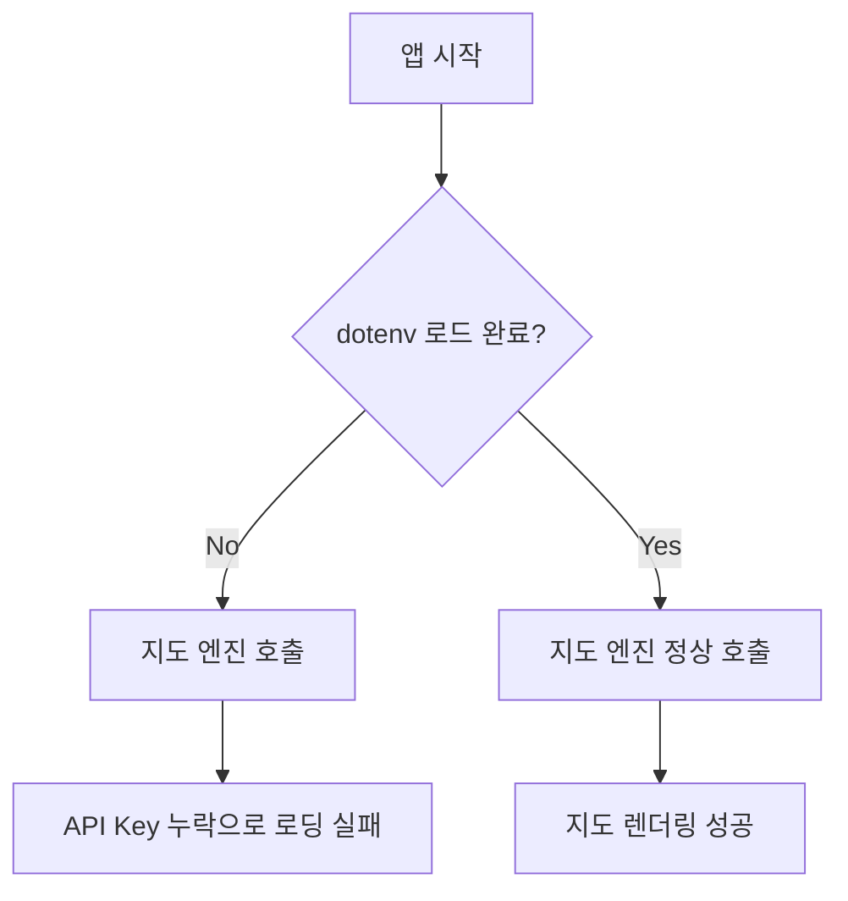

# fallingo 개발일지 - 44a2d9f..7272875 (11개 커밋)

**작업 기간**: 2026-02-10 ~ 2026-03-05

안녕하세요, Fallingo를 개발하고 있는 Su입니다! 🖐️  
2월 중순부터 3월 초까지 진행된 11개의 커밋 내용을 정리하며, 그동안 어떤 기술적 고민이 있었는지 기록해보려 합니다. 이번 기간에는 특히 앱의 첫인상을 결정짓는 **초기 구동 속도**와 **지도 기반 서비스의 안정성**을 확보하는 데 집중했습니다.

## 📝 이번 기간 작업 내용

### 1. 앱 성능 최적화 및 사용자 경험(UX) 개선
가장 최근 작업이자 이번 기간의 핵심입니다. 사용자 피드백을 반영하여 앱이 무겁게 느껴지는 부분들을 걷어냈습니다.
*   **음식 인식 프로세스 개선**: 이미지 분석 엔진의 응답 대기 시간을 조정하여 체감 속도를 높였습니다.
*   **초기 구동 및 피드 프리로드 최적화**: 앱 실행 시 발생하는 병목 현상을 해결하기 위해 타임아웃 전략을 수정했습니다.
*   **API 타임아웃 단축**: 무한 대기에 빠지는 현상을 방지하기 위해 네트워크 타임아웃을 공격적으로 설정했습니다.

### 2. 핵심 기능 버그 수정 및 안정화
지도와 검색, 서비스의 뼈대가 되는 부분에서 발견된 치명적인 버그들을 해결했습니다.
*   **지도 타일 로딩 실패 수정**: `dotenv` 라이브러리가 초기화되기 전에 환경 변수에 접근하여 지도가 나오지 않던 문제를 해결했습니다. (가장 당황스러웠던 버그였어요! 😅)
*   **검색 API 라우트 경로 수정**: 백엔드 리팩토링 과정에서 어긋났던 API Prefix(`/api/v1/...`)를 바로잡았습니다.
*   **월드이벤트 피드 안정화**: 대량의 데이터가 조회될 때 피드 검색이 멈추던 현상을 개선했습니다.

### 3. 테스트 환경 구축 및 의존성 관리
유료 기능 개발과 보안을 위한 밑작업도 병행했습니다.
*   **유료 마커 결제 바이패스**: 테스트 모드에서 실제 결제 없이도 유료 마커 기능을 검증할 수 있는 로직을 추가했습니다.
*   **의존성 업데이트 (Dependabot)**: 백엔드의 비동기 처리를 담당하는 핵심 라이브러리들을 최신 버전으로 올렸습니다.

| 패키지명 | 이전 버전 | 업데이트 버전 | 용도 |
|:---|:---:|:---:|:---|
| `aiosqlite` | 0.20.0 | 0.22.1 | 비동기 SQLite 처리 |
| `aiofiles` | 24.1.0 | 25.1.0 | 비동기 파일 입출력 |

## 💡 작업 하이라이트

### 🚀 성능 병목 구간의 과감한 절단
이번 작업 중 가장 의미 있었던 것은 **타임아웃 전략의 변경**입니다. 기존에는 네트워크가 불안정할 경우 앱이 사용자에게 아무런 응답 없이 대기하는 시간이 길었습니다.

```dart
// AS-IS: 기본 설정 사용 (대기 시간 김)
final response = await api.getFeed().timeout(Duration(seconds: 30));

// TO-BE: 공격적인 타임아웃과 프리로드 최적화
final response = await api.getFeed().timeout(Duration(seconds: 5));
// 실패 시 캐시 데이터를 우선 보여주거나 재시도 로직 실행
```

피드 프리로드 타임아웃을 단축함으로써, 사용자는 "무한 로딩" 대신 "빠른 피드 노출" 또는 "재시도 안내"를 받게 되어 이탈률을 줄일 수 있게 되었습니다.

### 🗺️ "지도가 안 나와요!" - Dotenv 초기화의 교훈
Flutter에서 환경 변수를 관리할 때 `flutter_dotenv`를 사용하는데, 지도 엔진이 구동되는 시점보다 `dotenv.load()`가 늦게 완료되면서 API Key를 읽어오지 못하는 문제가 있었습니다.



비동기 초기화 순서를 엄격하게 제어(`await dotenv.load()`)하여 해결했으며, 기본적이지만 중요한 **생명주기 관리**의 중요성을 다시 한번 깨달았습니다.

## 📊 개발 현황

현재 Fallingo는 2025년 12월 베타 런칭을 향해 순항 중입니다. 최근 Google for Startups Cloud Program에 선정되어 인프라 비용 부담을 덜게 된 만큼, AI 기반 음식 인식 기능을 더욱 고도화할 예정입니다.

*   **백엔드 (FastAPI)**: 85% 완료 (API 안정화 및 보안 강화 단계)
*   **프론트엔드 (Flutter)**: 75% 진행 중 (UI 디테일 및 성능 최적화 단계)
*   **AI 모델 연동**: 60% 진행 중 (인식 정확도 개선 필요)

**Su의 한마디**: 
"경력이 쌓여도 `dotenv` 초기화 실수 같은 기본에서 넘어질 때가 있네요. 하지만 이런 작은 실패들이 모여 앱을 더 단단하게 만드는 것 같습니다. 3월에도 멈추지 않고 달려보겠습니다! 🔥"

---
*본 일지는 Fallingo 프로젝트의 실제 커밋 내역을 바탕으로 작성되었습니다.*