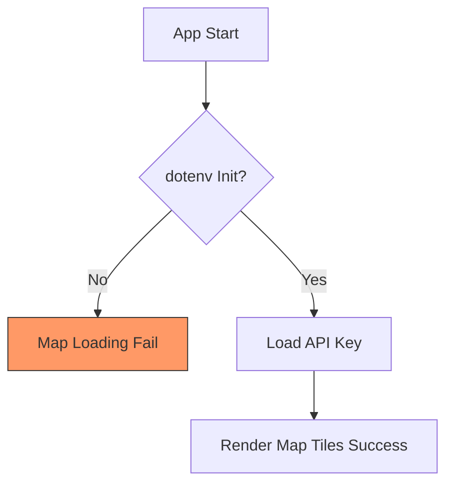

# fallingo 개발일지 - 44a2d9f..0b5d37a (13개 커밋)

**작업 기간**: 2026-02-10 ~ 2026-03-05

안녕하세요, Su입니다. 어느덧 2026년 봄이 다가오고 있네요. 지난 한 달여간의 Fallingo 개발 내용을 정리해 보았습니다. 이번 기간에는 새로운 기능을 마구 추가하기보다는, 기존 앱의 안정성을 높이고 사용자 경험(UX)의 핵심인 **'속도'**를 개선하는 데 집중했습니다.

## 📝 이번 기간 작업 내용

이번 기간의 13개 커밋은 크게 세 가지 영역으로 나뉩니다.

### 1. 앱 성능 최적화 및 사용자 경험(UX) 개선
가장 공을 많이 들인 부분입니다. 앱이 켜질 때 답답했던 부분들을 찾아내고, AI 음식 인식의 퍼포먼스를 끌어올렸습니다.
*   **음식 인식 및 초기 구동 최적화**: Claude의 도움을 받아 인식 로직의 병목을 해결했습니다.
*   **타임아웃 전략 수정**: 무한정 기다리던 피드 프리로드와 API 타임아웃을 단축하여, 네트워크 환경이 좋지 않을 때도 앱이 멈춘 것처럼 보이지 않게 수정했습니다.

### 2. 버그 수정 및 내부 로직 안정화
실제 서비스 운영 단계에서 치명적일 수 있는 문제들을 잡아냈습니다.
*   **지도 타일 로딩 오류 해결**: `dotenv`가 초기화되지 않아 지도 API 키를 읽어오지 못하던 문제를 수정했습니다. 🛠️
*   **검색 API 라우트 수정**: 백엔드 API prefix가 어긋나 있던 부분을 바로잡고 월드이벤트 피드 검색 기능을 안정화했습니다.
*   **결제 바이패스 추가**: 유료 마커 기능을 테스트할 때 매번 결제 과정을 거치지 않도록 `TESTING` 모드를 도입했습니다.

### 3. 종속성 및 라이브러리 업데이트 (Maintenance)
프로젝트의 건강을 위해 Dependabot이 제안한 보안 및 버전 업데이트를 충실히 반영했습니다.
*   **Backend**: `aiofiles` (24.1.0 -> 25.1.0), `aiosqlite` (0.20.0 -> 0.22.1)
*   **Frontend**: `build_runner` (2.11.0 -> 2.11.1)

| 영역 | 작업 내용 | 수량 |
| :--- | :--- | :---: |
| **Performance** | 피드 프리로드 및 API 타임아웃 최적화 | 2건 |
| **Fixes** | 지도 로딩, API 라우트, 음식 인식 로직 수정 | 4건 |
| **Features** | 유료 마커 테스트 모드 추가 | 1건 |
| **Deps** | 라이브러리 버전 업데이트 및 머지 | 6건 |

---

## 💡 작업 하이라이트

### 🚀 성능 병목의 범인은 '과도한 기다림'
이번 업데이트에서 가장 유의미했던 변화는 **타임아웃 단축**입니다. 기존에는 데이터를 완벽하게 가져오기 위해 타임아웃을 길게 잡았는데, 이것이 오히려 앱 초기 구동 시 '먹통' 현상을 유발하고 있었습니다.

```dart
// 기존 방식: 데이터가 올 때까지 길게 대기
final feedData = await api.getFeed().timeout(Duration(seconds: 10));

// 수정된 방식: 빠른 실패(Fast Fail) 후 캐시 활용 또는 재시도 유도
final feedData = await api.getFeed().timeout(Duration(seconds: 3));
```
사용자는 10초 동안 멈춘 화면을 보는 것보다, 3초 안에 "네트워크가 원활하지 않습니다"라는 메시지를 보거나 이전에 캐싱된 데이터를 보는 것을 선호한다는 점을 다시 한번 배웠습니다.

### 🗺️ 지도 타일 로딩 실패 (Environment Variable Issue)
지도가 간헐적으로 나오지 않던 문제는 의외로 단순한 곳에 있었습니다. Flutter 환경에서 환경 변수를 로드하기 전 지도 위젯이 먼저 렌더링되려다 보니 API Key를 참조하지 못한 것이었죠.


이 문제는 `main.dart`에서 `await dotenv.load()`의 위치를 보장함으로써 깔끔하게 해결했습니다. 비전공자 출신으로서 이런 기초적인 생명주기(Lifecycle) 문제는 언제나 겸손함을 배우게 하네요. 😅

---

## 📊 개발 현황

현재 Fallingo는 작년 말 베타 런칭 이후 수집된 피드백을 바탕으로 고도화 단계에 있습니다.

*   **백엔드 (FastAPI)**: 95% 완료 (안정화 및 검색 엔진 고도화 중)
*   **프론트엔드 (Flutter)**: 85% 진행 중 (UI 디테일 수정 및 성능 최적화 집중)
*   **AI 모델**: 음식 인식 정확도 개선 작업 지속 중

Google for Startups Cloud Program 덕분에 크레딧 걱정 없이 PostgreSQL 인스턴스를 넉넉하게 운영하며 성능 테스트를 할 수 있어 든든합니다. 2026년 상반기 내에 더 완벽해진 검색 기능과 매끄러운 UX로 다음 마일스톤을 달성하는 것이 목표입니다.

**Su의 한마디**: "코드 한 줄 줄이는 것보다, 사용자 대기 시간 1초 줄이는 것이 더 가치 있다는 걸 깨달은 한 달이었습니다. 계속 달려볼게요! 🏃‍♂️"