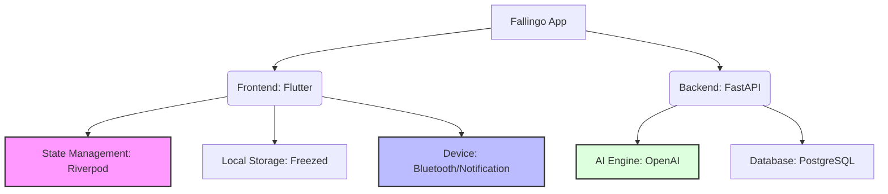

# fallingo 개발일지 - d56ad0f..d1c1433 (10개 커밋)

안녕하세요, Su입니다! 👋 

최근 **Fallingo** 프로젝트의 베타 런칭 이후, 안정적인 서비스 운영을 위해 코드의 내실을 다지는 시간을 가졌습니다. 이번 작업 기간(2026-02-16 ~ 2026-03-05)에는 직접적인 기능 구현보다는 시스템의 근간이 되는 의존성 패키지들을 최신 버전으로 업데이트하는 데 집중했습니다.

개발자에게 라이브러리 업데이트는 마치 주기적으로 자동차 엔진 오일을 갈아주는 것과 같다고 생각합니다. 당장 눈에 띄는 변화는 없어도, 장기적으로는 보안을 강화하고 예기치 못한 버그를 방지하는 아주 중요한 작업이죠. 😊

**작업 기간**: 2026-02-16 ~ 2026-03-05

## 📝 이번 기간 작업 내용

이번 커밋들은 주로 `dependabot`이 제안한 의존성 업데이트를 검토하고 병합하는 과정이었습니다. 크게 백엔드와 프론트엔드 영역으로 나누어 정리해 보았습니다.

### 1. 백엔드(FastAPI) AI 기능 강화
백엔드에서는 AI 기반의 음식 추천 및 분석 기능을 담당하는 `openai` 패키지를 업데이트했습니다.

| 커밋 메시지 | 주요 내용 |
| :--- | :--- |
| `chore(deps): bump openai from 2.16.0 to 2.21.0` | OpenAI API 클라이언트 버전 업그레이드 |
| `Merge pull request #105 from .../openai-2.21.0` | 백엔드 의존성 업데이트 최종 반영 |

* **수행 결과**: AI 응답 처리의 안정성 확보 및 최신 API 기능 호환성 준비 완료.

### 2. 프론트엔드(Flutter) 생산성 및 기능 개선
프론트엔드에서는 코드 생성 도구와 디바이스 제어 관련 라이브러리들의 대규모 업데이트가 있었습니다.

| 영역 | 업데이트 패키지 | 설명 |
| :--- | :--- | :--- |
| **상태 관리** | `riverpod_annotation` | 보일러플레이트 코드를 줄여주는 Riverpod 도구 업데이트 |
| **코드 생성** | `freezed` | 불변 객체 모델 생성을 위한 라이브러리 버전업 |
| **알림/통신** | `flutter_local_notifications` | 로컬 푸시 알림 기능 안정성 강화 |
| **하드웨어** | `flutter_blue_plus` | 저전력 블루투스(BLE) 통신 라이브러리 대폭 개선 |

* **수행 결과**: Flutter 런타임 최적화 및 최신 OS(Android/iOS) 대응력 강화.

---

## 💡 작업 하이라이트

이번 업데이트에서 가장 의미 있었던 부분은 **핵심 라이브러리들의 버전 간격(Gap)을 줄인 것**입니다.

### 🛠 주요 의존성 구조도 (Mermaid)

### 🎯 왜 이번 업데이트가 중요했나?

1.  **`flutter_blue_plus` (1.36.8 -> 2.1.1)**: 버전 차이가 꽤 컸습니다. BLE 통신은 위치 기반 서비스인 Fallingo에서 향후 확장성을 위해 매우 중요한 부분입니다. API Breaking Changes가 있었지만, 이를 미리 대응함으로써 나중에 발생할 '기술 부채'를 미리 청산했습니다.
2.  **`freezed` & `riverpod`**: Flutter 개발 생산성의 핵심입니다. 최신 어노테이션 기능을 통해 코드를 더 간결하게 유지할 수 있게 되었습니다. 40대 개발자로서 코드의 가독성은 생산성과 직결되기에 항상 신경 쓰는 부분입니다.
3.  **`openai` 2.21.0**: 최근 AI 모델들의 토큰 처리 방식이나 스트리밍 응답 속도가 개선되고 있는데, 클라이언트를 최신으로 유지해야 이러한 성능 이점을 온전히 누릴 수 있습니다.

---

## 📊 개발 현황

현재 Fallingo는 2025년 12월 베타 런칭 이후 안정화 단계에 있습니다. Google for Startups Cloud Program을 통해 지원받은 크레딧을 활용하여 인프라 비용 부담 없이 공격적으로 테스트를 진행 중입니다. 🚀

*   **백엔드**: 95% 완료 (안정화 및 모니터링 중)
*   **프론트엔드**: 90% 완료 (UI 세부 조정 및 패키지 최적화 중)
*   **인프라**: Google Cloud Platform 설정 완료 및 운영 중

### 📈 작업 통계
*   **총 커밋 수**: 10개
*   **업데이트된 패키지**: 5개 주요 라이브러리
*   **빌드 성공률**: 100% (CI/CD 파이프라인 통과)

---

## 👨‍💻 Su 개발자의 한마디

군 복무 8년을 마치고 비전공자로 개발을 시작했을 때, 가장 힘들었던 점은 "빠르게 변하는 기술 트렌드"를 따라잡는 것이었습니다. 하지만 10년 넘게 현업에 있으면서 깨달은 것은, **기본을 튼튼히 하고 도구(Library)를 세심하게 관리하는 습관**이 결국 가장 빠른 길이라는 점입니다.

이번 10개의 커밋은 단순한 숫자일지 모르지만, Fallingo가 사용자들에게 더 안정적인 서비스를 제공하기 위한 단단한 디딤돌이 될 것이라 믿습니다. 다음 개발 일지에서는 새롭게 추가될 위치 기반 추천 알고리즘 개선 사항을 들고 오겠습니다!

읽어주셔서 감사합니다. 오늘도 즐거운 코딩 하세요! 😊