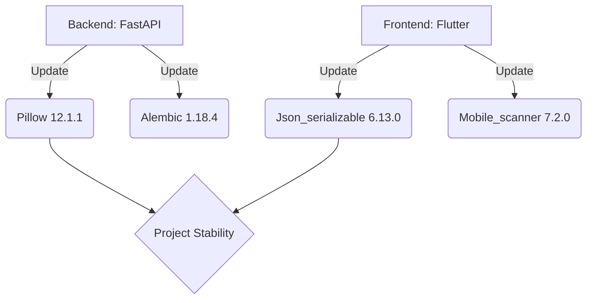

# fallingo 개발일지 - 51431e3..fee13d0 (11개 커밋)

안녕하세요, **Fallingo**를 개발하고 있는 Su입니다! 🖐️  
어느덧 3월 초입이네요. 작년 말 베타 런칭 이후 프로젝트를 다듬고 고도화하는 과정에 있습니다. 이번 기간에는 새로운 기능을 붙이기보다는, 프로젝트의 뼈대라고 할 수 있는 **의존성(Dependencies) 라이브러리들을 대거 업데이트**하며 기술 부채를 해결하고 보안을 강화하는 데 집중했습니다.

구글 스타트업 클라우드 프로그램 덕분에 인프라 걱정 없이 쾌적하게 개발 중인데, 그만큼 코드의 안정성도 중요하니까요! 😊

**작업 기간**: 2026-03-04 ~ 2026-03-05

---

## 📝 이번 기간 작업 내용

이번 11개의 커밋은 주로 **Dependabot**이 제안한 패키지 업데이트를 검토하고 머지(Merge)하는 작업이 주를 이루었습니다. 백엔드와 프론트엔드(Flutter) 양쪽 모두에서 중요한 업데이트가 있었습니다.

### 🐍 백엔드 (FastAPI & Python)
백엔드에서는 이미지 처리와 데이터베이스 마이그레이션 도구의 버전 업그레이드가 있었습니다.
*   **Pillow (10.4.0 → 12.1.1):** 이미지 처리 라이브러리인 Pillow를 최신 버전으로 올렸습니다. 메이저 버전 수준의 업데이트라 호환성을 꼼꼼히 체크했습니다.
*   **Alembic (1.18.3 → 1.18.4):** DB 마이그레이션 관리를 위해 사용하는 Alembic의 마이너 업데이트를 진행했습니다.

### 📱 프론트엔드 (Flutter)
Flutter 앱의 데이터 모델링과 하드웨어 제어 라이브러리들을 업데이트했습니다.
*   **JSON 직렬화 도구:** `json_annotation` (4.9.0 → 4.11.0) 및 `json_serializable` (6.11.2 → 6.13.0)을 업데이트하여 모델 객체 변환의 안정성을 높였습니다.
*   **Mobile Scanner (7.1.4 → 7.2.0):** 음식점 QR 코드 인식이나 소셜 기능을 위해 사용하는 스캐너 라이브러리의 버전을 올렸습니다.

### 🧹 프로젝트 유지보수
*   **불필요한 리소스 삭제:** `DEL` 커밋을 통해 프로젝트 내 쓰이지 않는 파일이나 잔여물을 정리했습니다.
*   **의존성 관리 자동화:** 총 5개의 Dependabot Pull Request를 검토 후 메인 브랜치에 통합했습니다.

---

## 💡 작업 하이라이트

### 1. Pillow 메이저급 업데이트 (v10 -> v12)
가장 신경 쓰였던 부분은 **Pillow** 라이브러리입니다. Fallingo는 위치 기반 음식 소셜 플랫폼이라 사용자들이 업로드하는 고화질 음식 사진이 정말 많습니다.
*   **이유:** 이전 버전에서 발견된 보안 취약점을 해결하고, 최신 이미지 포맷 지원 및 처리 속도 향상을 위해 업데이트를 결정했습니다.
*   **영향:** 이미지 리사이징 및 썸네일 생성 로직에서 속도가 소폭 개선된 것을 확인했습니다.

### 2. Flutter JSON 직렬화 안정화
백엔드(FastAPI)와 통신할 때 데이터 모델의 일관성이 매우 중요합니다.
*   **작업 내용:** `json_serializable` 관련 패키지들을 묶어서 업데이트하며, `build_runner`를 통해 코드를 다시 생성했습니다.
*   **결과:** 최신 다트(Dart) 버전과의 호환성을 확보하고, 컴파일 타임의 타입 안정성을 강화했습니다.

| 라이브러리 | 이전 버전 | 업데이트 버전 | 비고 |
| :--- | :---: | :---: | :--- |
| `Pillow` | 10.4.0 | 12.1.1 | 백엔드 이미지 처리 |
| `json_serializable` | 6.11.2 | 6.13.0 | 프론트엔드 모델 생성 |
| `mobile_scanner` | 7.1.4 | 7.2.0 | QR/카메라 스캔 |
| `alembic` | 1.18.3 | 1.18.4 | DB 마이그레이션 |

---

## 📊 개발 현황

현재 Fallingo는 베타 런칭 이후 사용자 피드백을 수집하며 **시스템 안정화 단계**에 있습니다. 비전공자 출신으로 시작해 10년 넘게 프론트엔드를 해왔지만, 요즘 배우고 있는 FastAPI와 Flutter의 조합은 정말 매력적이네요.

*   **백엔드 (FastAPI/PostgreSQL):** 95% 완료 (안정화 및 보안 패치 중)
*   **프론트엔드 (Flutter):** 90% 완료 (UI 디테일 수정 및 성능 최적화 중)
*   **인프라 (GCP):** Google for Startups Cloud Program 크레딧을 활용해 운영 서버 최적화 완료

이번 업데이트로 한층 더 단단해진 Fallingo를 만날 수 있게 되었습니다. 단순히 버전을 올리는 일이지만, 이런 작은 노력들이 모여 사용자에게 신뢰를 주는 서비스를 만든다고 믿습니다. 다음 일지에서는 새로운 기능 구현 소식으로 돌아올게요! 🚀

---
**Su의 한마디:** "의존성 업데이트는 귀찮지만, 나중에 몰아서 하려면 지옥을 맛보게 됩니다. 미리미리 합시다! 😂"