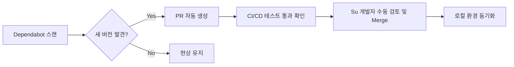

# fallingo 개발일지 - 5458c89..11daa51 (10개 커밋)

안녕하세요, **Fallingo**를 개발하고 있는 Su입니다! 👋

최근 며칠 동안은 새로운 기능을 붙이기보다는, 프로젝트의 기반을 단단하게 다지는 **'Sharpening the Saw(톱날 갈기)'** 시간을 가졌습니다. 2025년 12월 베타 런칭을 목표로 달리고 있는 만큼, 서비스가 커지기 전에 의존성 라이브러리들을 최신으로 유지하고 보안 취약점을 미리 방어하는 것이 중요하다고 판단했거든요.

이번 개발 일지에서는 2026년 2월 말부터 3월 초까지 진행된 10개의 커밋 내용을 정리해 보았습니다.

**작업 기간**: 2026-02-23 ~ 2026-03-06

---

## 📝 이번 기간 작업 내용

이번 커밋들은 주로 **Dependabot**을 통한 자동화된 의존성 관리와 백엔드 환경 안정화에 집중되었습니다.

### 1. 백엔드 핵심 라이브러리 업데이트
FastAPI 기반의 백엔드 성능과 보안을 위해 주요 서버 및 인증 라이브러리를 업데이트했습니다.
*   **Uvicorn 업데이트 (0.40.0 -> 0.41.0)**: ASGI 서버의 최신 버전을 적용하여 성능 최적화 및 버그 수정을 반영했습니다.
*   **Azure Identity 업데이트 (1.25.1 -> 1.25.2)**: 인증 관련 라이브러리의 마이너 업데이트를 통해 보안 안정성을 높였습니다.

### 2. 보안 및 CI/CD 워크플로우 강화
코드 퀄리티와 보안 취약점을 자동으로 스캔하는 도구들을 개선했습니다.
*   **GitHub CodeQL Action 업데이트 (4.32.2 -> 4.32.4)**: 최신 보안 취약점 패턴을 감지할 수 있도록 분석 엔진 버전을 올렸습니다.

### 3. 패키지 그룹 관리 (Production/Development)
개별 라이브러리 외에도 사용 목적에 따라 묶인 패키지 그룹들을 일괄 업데이트하여 버전 충돌을 방지했습니다.
*   **Production Group 업데이트**: 실제 운영 환경에 배포되는 라이브러리들(2건)을 일괄 갱신했습니다.
*   **Development Group 업데이트**: 로컬 개발 및 테스트 환경에서 사용하는 도구들(2건)을 최신화했습니다.

| 분류 | 주요 작업 내용 | 커밋 수 |
| :--- | :--- | :---: |
| **백엔드 인프라** | Uvicorn 및 Azure 인증 라이브러리 업데이트 | 4 |
| **CI/CD/보안** | CodeQL 액션 버전 업데이트 및 보안 스캔 강화 | 2 |
| **의존성 관리** | Production 및 Development 패키지 그룹 최적화 | 4 |

---

## 💡 작업 하이라이트

### 🛡️ 보안은 타협할 수 없는 기본
이번 작업의 핵심은 **보안 가시성 확보**였습니다. 비전공자 출신으로 개발을 시작해 10년 넘게 프론트엔드 중심으로 일해왔지만, 백엔드와 인프라를 직접 만지면서 가장 신경 쓰이는 부분이 바로 '보안'이더라고요. 

특히 Google for Startups Cloud Program에 선정되어 크레딧을 지원받고 있는 만큼, 클라우드 자원을 효율적이고 안전하게 사용하는 것이 중요했습니다. CodeQL 업데이트는 단순한 버전 업이 아니라, 우리 코드에 숨어있을지 모르는 잠재적 위협을 매 커밋마다 꼼꼼히 살피겠다는 의지의 표현이기도 합니다.

### ⚙️ 의존성 관리 자동화 프로세스
저는 Dependabot을 적극적으로 활용하고 있습니다. 매일 아침 커피 한 잔과 함께 Dependabot이 올려둔 PR을 검토하고 병합하는 과정은 이제 제 루틴이 되었네요.

---

## 📊 개발 현황

현재 Fallingo 프로젝트는 전체적인 아키텍처 설계를 마치고 백엔드 코어 로직을 구체화하는 단계에 있습니다.

*   **백엔드 (FastAPI + PostgreSQL)**: 65% 진행 중 (인증 및 기본 API 구조 완료, 위치 기반 쿼리 최적화 중)
*   **프론트엔드 (React/Next.js)**: 40% 진행 중 (프로토타입 디자인 및 컴포넌트 라이브러리 구축 완료)
*   **모바일 (Flutter)**: 15% 진행 중 (기본 스캐폴딩 및 통신 모듈 테스트)
*   **인프라 (GCP)**: 80% 진행 중 (CI/CD 파이프라인 및 스테이징 환경 구축 완료)

### 🧐 배운 점과 느낀 점
의존성 업데이트가 때로는 귀찮은 작업처럼 느껴질 수 있지만, 이번에 `uvicorn` 버전을 올리면서 릴리즈 노트를 꼼꼼히 읽어보니 제가 미처 몰랐던 ASGI 표준의 변화나 성능 개선 포인트들을 배울 수 있었습니다. "공부는 끝이 없다"는 말을 다시 한번 실감하며, 오늘도 한 걸음 더 성장한 기분이 듭니다. 🫡

다음 일지에서는 드디어 위치 기반 검색 API를 리팩토링한 내용을 공유할 수 있을 것 같습니다. 곧 또 소식 전할게요!

---
**Su** | *비전공자로 시작해 10년을 넘어, 이제는 AI와 함께 새로운 도전을 이어가는 개발자입니다.*