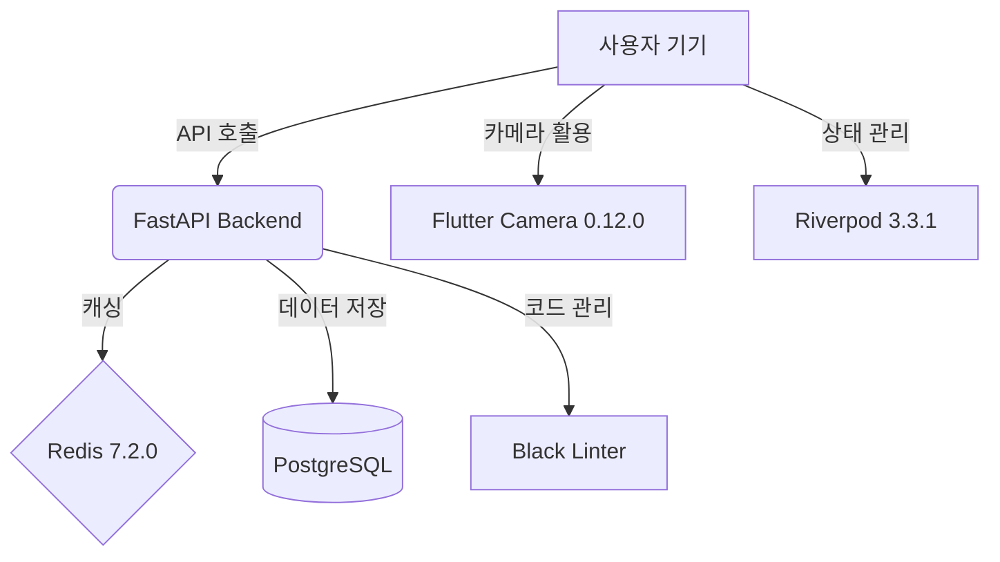

# fallingo 개발일지 - f89aed5..1c9b1bd (10개 커밋)

안녕하세요, Fallingo를 개발하고 있는 Su입니다! 🖐️

어느덧 3월의 중순을 지나 하순으로 접어들고 있네요. 2025년 12월 베타 런칭 이후, 사용자분들의 피드백을 반영하며 서비스의 내실을 다지는 시기를 보내고 있습니다. 이번 기간(3월 6일 ~ 3월 20일)에는 새로운 기능을 추가하기보다는, 우리 서비스의 근간이 되는 **의존성(Dependencies)들을 최신 버전으로 관리**하며 시스템의 안정성과 보안을 강화하는 데 집중했습니다.

개발자라면 누구나 공감하겠지만, 라이브러리 업데이트는 '잘 되면 본전, 안 되면 대참사'인 작업이죠. 하지만 지속 가능한 서비스를 위해서는 결코 소홀히 할 수 없는 과정이기도 합니다. 이번 10개의 커밋을 통해 어떤 변화가 있었는지 공유해 드릴게요! 🚀

---

**작업 기간**: 2026-03-06 ~ 2026-03-20

## 📝 이번 기간 작업 내용

이번 작업은 주로 **백엔드(FastAPI)**와 **프론트엔드(Flutter)** 양쪽의 핵심 라이브러리들을 최신화하는 작업이었습니다. Dependabot의 도움을 받아 안전하게 병합(Merge)을 진행했습니다.

### ⚙️ 백엔드(FastAPI/Python) 인프라 및 도구 개선
백엔드는 데이터의 무결성과 성능이 최우선입니다. 특히 캐싱과 린팅 도구를 업데이트하여 개발 효율을 높였습니다.

| 라이브러리 | 이전 버전 | 업데이트 버전 | 주요 용도 |
| :--- | :--- | :--- | :--- |
| **redis** | 7.1.0 | 7.2.0 | 데이터 캐싱 및 세션 관리 |
| **filelock** | 3.20.3 | 3.25.2 | 파일 시스템 동기화 및 리소스 잠금 |
| **black** | (dev group) | 최신화 | 코드 포맷팅 자동화 (Lint) |

*   **Redis 업데이트**: `fallingo`의 위치 기반 검색 성능을 책임지는 Redis를 v7.2.0으로 올렸습니다. 안정성이 개선되어 클러스터 환경에서의 응답 속도가 더욱 균일해질 것으로 기대합니다.
*   **Black 적용**: 협업(미래의 동료들과의!)을 대비해 코드 스타일을 엄격하게 관리하고 있습니다.

### 📱 프론트엔드(Flutter/Dart) 핵심 모듈 업데이트
우리 앱의 핵심 기능인 '음식 사진 촬영'과 '상태 관리'에 직접적인 영향을 주는 업데이트입니다.

*   **flutter_riverpod (3.2.1 → 3.3.1)**: Fallingo의 상태 관리를 책임지는 Riverpod을 업데이트했습니다. 비전공자 출신인 제게 리액티브 프로그래밍의 재미를 알려준 고마운 친구죠. 더욱 정교한 상태 감시가 가능해졌습니다.
*   **camera (0.11.3+1 → 0.12.0)**: 음식 소셜 플랫폼에서 카메라는 심장과 같습니다. 메이저 마이너 버전 업데이트인 만큼, 최신 기기에서의 촬영 안정성과 해상도 대응이 개선되었습니다.

---

## 💡 작업 하이라이트

### 1. 기술적 부채 청산: Dependabot과의 협업 🤖
혼자 개발하다 보면 라이브러리 업데이트를 놓치기 쉬운데요, 이번에 **Dependabot**을 적극적으로 활용하여 10개의 PR을 차례로 검토하고 병합했습니다. 
- **배운 점**: 단순히 'Update' 버튼만 누르는 게 아니라, 각 라이브러리의 Changelog를 읽으며 우리 서비스에 미칠 영향(Breaking Changes)을 파악하는 습관을 들였습니다. 다행히 이번 업데이트에서는 큰 호환성 이슈 없이 깔끔하게 완료되었습니다!

### 2. 카메라 모듈 최신화 (Flutter Camera 0.12.0) 📸
Fallingo는 사용자가 맛있는 음식 사진을 찍어 공유하는 것이 핵심입니다. `camera` 패키지 업데이트는 단순한 숫자 변경 이상의 의미가 있었습니다.
- **도전**: 특정 안드로이드 기기에서 발생하던 프리뷰 끊김 현상을 해결하기 위해 이번 업데이트가 꼭 필요했습니다. 업데이트 후 내부 테스트 결과, 이전보다 훨씬 부드러운 UX를 제공할 수 있게 되었습니다.

---

## 📊 개발 현황

구글 포 스타트업 클라우드 프로그램(Google for Startups Cloud Program) 덕분에 인프라 비용 걱정 없이 다양한 시도를 해보고 있습니다. 현재 Fallingo의 완성도는 다음과 같습니다.

- **백엔드 (FastAPI)**: 95% 완료 (최적화 및 보안 강화 단계)
- **프론트엔드 (Flutter)**: 85% 완료 (UI 디테일 수정 및 사용자 피드백 반영 중)
- **인프라 (PostgreSQL/Redis)**: 90% 완료 (백업 자동화 구성 중)

---

## 💬 마치며

이번 기간은 눈에 보이는 화려한 기능을 만들지는 않았지만, 서비스가 더 높이 날아오르기 위해 엔진을 점검하는 귀중한 시간이었습니다. 10년 차 프론트엔드 개발자로서 React에 익숙했던 제가 Flutter와 FastAPI의 생태계에 깊이 동화되어 가는 과정이 참 즐겁습니다.

군 복무 8년 후, 뒤늦게 개발의 길로 들어섰을 때의 그 초심을 잃지 않고, 2025년 12월 정식 런칭까지(이미 베타는 나왔지만요!) 묵묵히 달려보겠습니다.

다음 개발일지에서는 더 흥미로운 기능 구현 이야기로 돌아올게요. 읽어주셔서 감사합니다! 😊

**Su 드림**