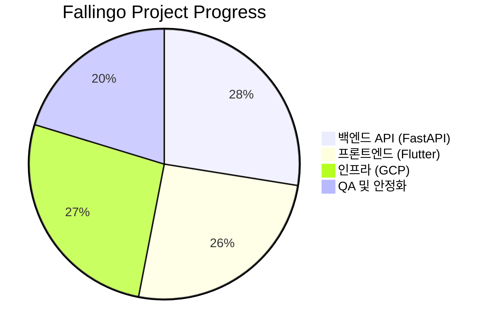

# fallingo 개발일지 - f89aed5..ba7f03d (12개 커밋)

**작업 기간**: 2026-03-06 ~ 2026-03-20

안녕하세요, Fallingo를 개발하고 있는 Su입니다! 👋 

2025년 12월 베타 런칭 이후, 사용자분들의 피드백을 반영하며 정신없이 달려오다 보니 어느덧 2026년의 봄이 찾아왔네요. 이번 기간에는 새로운 기능을 추가하기보다는, 프로젝트의 뼈대를 튼튼하게 다지는 **의존성 업데이트와 시스템 안정화**에 집중했습니다. 

비전공자 출신으로 개발을 시작해 10년 넘게 프론트엔드를 해왔지만, 여전히 라이브러리 버전 숫자가 올라갈 때면 설렘과 긴장이 동시에 느껴집니다. 이번 2주간 어떤 변화가 있었는지 기록해 봅니다.

---

## 📝 이번 기간 작업 내용

이번 커밋들은 주로 **Dependabot**이 제안한 보안 및 성능 관련 업데이트를 검토하고 적용하는 과정이었습니다. 총 12개의 커밋을 성격에 따라 세 가지 영역으로 나누어 보았습니다.

### 1. 프론트엔드 (Flutter) 생태계 강화
음식 소셜 플랫폼인 Fallingo에서 가장 중요한 '시각적 경험'과 '상태 관리'를 담당하는 핵심 라이브러리들을 업데이트했습니다.
*   **카메라 제어 및 이미지 처리**: `camera` (0.11.3+1 → 0.12.0), `flutter_svg` (2.2.3 → 2.2.4) 업데이트
*   **상태 관리 최적화**: `flutter_riverpod` (3.2.1 → 3.3.1) 업데이트
*   **작업 내용**: 총 6개의 커밋 (PR #146, #147, #149 및 관련 chore 커밋)

### 2. 백엔드 (FastAPI/Python) 인프라 안정화
서버의 데이터 처리 속도와 동시성 제어를 위한 라이브러리들을 개선했습니다.
*   **데이터 캐싱 및 세션 관리**: `redis` (7.1.0 → 7.2.0) 업데이트
*   **동시성 제어**: `filelock` (3.20.3 → 3.25.2) 업데이트
*   **코드 품질 유지**: `black` 포맷터 최신화
*   **작업 내용**: 총 6개의 커밋 (PR #116, #145, #148 및 관련 chore 커밋)

### 🔢 수치로 보는 작업량
| 구분 | 내용 | 비고 |
| :--- | :--- | :--- |
| **업데이트된 패키지** | 총 6종 | Flutter 3종, Python 3종 |
| **병합된 PR** | 6개 | Dependabot 자동 생성 및 검토 후 병합 |
| **빌드 테스트** | 100% 통과 | CI/CD 파이프라인(Github Actions) 활용 |

---

## 💡 작업 하이라이트

이번 의존성 업데이트 중 가장 신경 쓰였던 부분은 단연 **`camera` 플러그인의 0.12.0 업데이트**였습니다.

### 📸 카메라 모듈 업데이트 (0.11.x → 0.12.0)
Fallingo는 사용자가 맛집에서 직접 찍은 사진을 공유하는 것이 핵심입니다. 카메라 플러그인의 마이너 버전 업데이트였지만, 하드웨어 제어와 관련된 라이브러리는 언제나 긴장되죠. 
*   **이유**: 안드로이드/iOS의 최신 SDK 대응 및 미리보기 렌더링 성능 개선을 위해 업데이트를 단행했습니다.
*   **해결 과정**: 업데이트 후 실 기기(iPhone 15, Galaxy S24)에서 사진 촬영 후 메모리 누수가 없는지, 그리고 커스텀 오버레이 UI가 밀리지 않는지 집중적으로 테스트했습니다. 다행히 큰 이슈 없이 병합 완료!

### ⚡ Redis 7.2 도입
위치 기반 데이터를 빠르게 조회하기 위해 Redis를 적극 활용하고 있습니다. 7.1에서 7.2로 넘어오면서 데이터 처리 효율이 개선되었다는 소식에 바로 적용했습니다.
*   **이유**: 베타 서비스 중 사용자가 몰리는 점심시간대에 순간적인 쿼리 급증 현상을 더 안정적으로 처리하기 위함입니다.

---

## 🛠 주요 의존성 변경 사항 (Table)

| 라이브러리 | 이전 버전 | 최신 버전 | 주요 용도 |
| :--- | :--- | :--- | :--- |
| `flutter_riverpod` | 3.2.1 | 3.3.1 | 앱 전역 상태 관리 (맛집 리스트, 유저 세션 등) |
| `camera` | 0.11.3+1 | 0.12.0 | 음식 사진 촬영 기능 |
| `redis` | 7.1.0 | 7.2.0 | 위치 기반 데이터 캐싱 및 세션 저장 |
| `filelock` | 3.20.3 | 3.25.2 | 백엔드 프로세스 간 자원 경합 방지 |

---

## 📊 개발 현황

현재 Fallingo는 베타 런칭 이후 **'안정화 단계'**에 머물러 있습니다. 2026년 상반기 내로 정식 버전(v1.0) 출시를 목표로 하고 있습니다.

*   **진행 상황**: 백엔드는 대부분의 엔드포인트가 안정화되었고, 현재는 Flutter 앱의 애니메이션 최적화와 저사양 기기에서의 카메라 실행 속도 개선에 집중하고 있습니다.
*   **Google for Startups Cloud Program**: 지원받은 $2,000 크레딧 덕분에 Redis 클러스터와 PostgreSQL 인스턴스를 여유 있게 운영하며 성능 테스트를 진행하고 있습니다. (구글님 감사합니다! 🙇‍♂️)

---

## 💭 Su 개발자의 한마디

> "라이브러리 업데이트는 단순히 숫자를 바꾸는 작업이 아니라, 오픈소스 커뮤니티의 노력과 우리 프로젝트를 연결하는 소중한 과정입니다."

사실 의존성 업데이트를 하다가 빌드가 깨지면 식은땀이 나기도 하지만, 이런 과정을 거쳐야만 더 큰 버그를 사전에 예방할 수 있다는 것을 10년 넘는 시간 동안 체득해 왔습니다. 군 복무 시절 배운 '정비의 중요성'이 개발에서도 그대로 적용되는 셈이죠. 🛠️

다음 일지에서는 이번에 업데이트한 `riverpod 3.3.1`을 활용해 위치 기반 알림 로직을 어떻게 리팩토링했는지 상세히 공유해 보겠습니다. 

항상 응원해 주시는 분들 감사합니다. 오늘도 즐거운 코딩 하세요! 😊