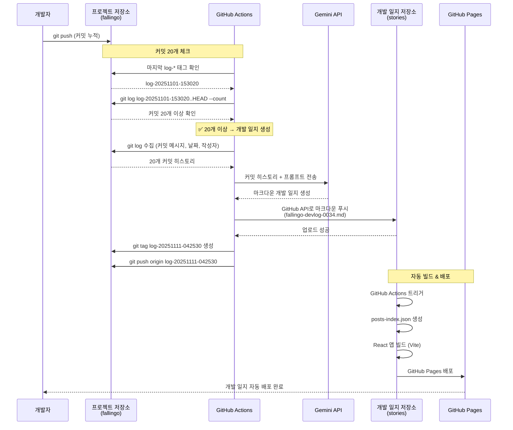
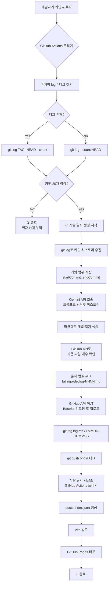

# GitHub Actions + Gemini API로 커밋 20개마다 개발 일지 자동 생성하기

## 문제: 개발 일지를 꾸준히 쓰기 어렵다

개발자라면 누구나 이런 고민이 있습니다:

- **"개발 일지를 작성하고 싶은데 시간이 없다"**
- **"프로젝트 진행 상황을 기록하고 싶은데 귀찮다"**
- **"커밋은 매일 하는데 문서화는 못하고 있다"**

저도 fallingo 개발하면서 같은 문제를 겪었습니다. 매주 개발 일지를 작성하려고 했지만, 막상 앉아서 쓰려니 "뭐 했더라?" 하면서 커밋 히스토리를 다시 읽어야 했습니다.

## 해결책: 커밋 20개마다 자동으로 개발 일지 생성

그래서 이런 시스템을 만들었습니다:

1. **프로젝트 저장소**에서 마지막 개발 일지 태그 이후 **커밋이 20개 쌓이면** 자동 트리거
2. **Gemini API**(Google의 무료 AI)로 커밋 히스토리 분석 및 **마크다운 개발 일지 자동 생성**
3. 생성된 개발 일지를 **개발 일지 저장소**로 **자동 푸시**
4. 개발 일지 저장소의 **GitHub Actions가 자동으로 재배포**

**핵심 포인트:**
- **Git 태그로 상태 관리**: 마지막 개발 일지 시점을 `log-YYYYMMDD-HHMMSS` 태그로 기록
- **자동 커밋 카운팅**: 태그 이후 20개 커밋이 쌓였는지 자동 체크
- **순차 번호 부여**: GitHub API로 기존 개발 일지 개수 확인하여 `fallingo-devlog-0034.md` 형식으로 자동 번호 부여

**결과:** 개발에만 집중하면, 커밋 20개마다 개발 일지가 자동으로 작성되고 배포됩니다.

## 시스템 아키텍처



## 핵심 구성 요소

### 1. GitHub Actions Workflow (프로젝트 저장소)

```yaml
# .github/workflows/auto-dev-log.yml
name: Auto Dev Log Post

on:
  push:
    branches:
      - main
  workflow_dispatch: # 수동 실행도 가능

jobs:
  generate-log:
    runs-on: ubuntu-latest
    permissions:
      contents: write  # 태그 push 권한

    steps:
      - name: Checkout 프로젝트 저장소
        uses: actions/checkout@v4
        with:
          repository: <프로젝트-계정>/<프로젝트-저장소>
          fetch-depth: 0 # 전체 커밋 히스토리 가져오기

      - name: 마지막 개발 일지 이후 커밋 개수 체크
        id: check
        run: |
          # 마지막 개발 일지 태그 찾기 (log-* 패턴)
          LAST_LOG_TAG=$(git tag -l "log-*" | sort -V | tail -1)

          if [ -z "$LAST_LOG_TAG" ]; then
            # 태그가 없으면 전체 커밋 개수
            COMMIT_COUNT=$(git rev-list --count HEAD)
          else
            # 마지막 개발 일지 이후 커밋 개수
            COMMIT_COUNT=$(git rev-list --count ${LAST_LOG_TAG}..HEAD)
          fi

          echo "커밋 개수: $COMMIT_COUNT"
          echo "count=$COMMIT_COUNT" >> $GITHUB_OUTPUT

          # 20개 이상이면 개발 일지 생성
          if [ $COMMIT_COUNT -ge 20 ]; then
            echo "✅ 20개 이상 커밋 누적 → 개발 일지 생성"
            echo "should_run=true" >> $GITHUB_OUTPUT
          else
            echo "⏳ 커밋 $COMMIT_COUNT개 누적 중 (20개 필요)"
            echo "should_run=false" >> $GITHUB_OUTPUT
          fi

      - name: Node.js 설정
        if: steps.check.outputs.should_run == 'true'
        uses: actions/setup-node@v4
        with:
          node-version: '20'

      - name: 의존성 설치
        if: steps.check.outputs.should_run == 'true'
        run: |
          cd dev-log
          npm install

      - name: 개발 일지 생성
        if: steps.check.outputs.should_run == 'true'
        env:
          GEMINI_API_KEY: ${{ secrets.GEMINI_API_KEY }}
          DEV_LOG_TOKEN: ${{ secrets.DEV_LOG_TOKEN }}
          DEV_LOG_REPO: <계정>/<개발일지-저장소>
        run: |
          cd dev-log
          node generate-log.js

      - name: 개발 일지 태그 생성
        if: steps.check.outputs.should_run == 'true'
        run: |
          TAG_NAME="log-$(date +%Y%m%d-%H%M%S)"
          git config user.name "github-actions[bot]"
          git config user.email "github-actions[bot]@users.noreply.github.com"
          git tag "$TAG_NAME"
          git push origin "$TAG_NAME"
          echo "✅ 태그 생성: $TAG_NAME"
```

**핵심 로직:**
1. **태그 기반 커밋 카운팅**: `git tag -l "log-*"`로 마지막 개발 일지 태그 찾기
2. **Git Range 계산**: `${LAST_LOG_TAG}..HEAD`로 새 커밋만 카운팅
3. **조건부 실행**: 20개 이상일 때만 `should_run=true`
4. **태그 자동 생성**: 개발 일지 생성 후 `log-YYYYMMDD-HHMMSS` 태그 푸시

### 2. 개발 일지 생성 스크립트

```javascript
// dev-log/generate-log.js
import { GoogleGenerativeAI } from '@google/generative-ai';
import { execSync } from 'child_process';
import fetch from 'node-fetch';

// 환경 변수
const GEMINI_API_KEY = process.env.GEMINI_API_KEY;
const DEV_LOG_TOKEN = process.env.DEV_LOG_TOKEN;
const DEV_LOG_REPO = process.env.DEV_LOG_REPO; // "계정/저장소" 형식

// Gemini AI 초기화 (gemini-2.5-flash, 일일 1,000만 토큰 무료)
const genAI = new GoogleGenerativeAI(GEMINI_API_KEY);
const model = genAI.getGenerativeModel({ model: 'gemini-2.5-flash' });

// 1️⃣ 마지막 개발 일지 이후 커밋 히스토리 가져오기
function getCommitsSinceLastLog() {
  let gitRange = 'HEAD';
  try {
    const lastLogTag = execSync(
      `git tag -l "log-*" | sort -V | tail -1`,
      { encoding: 'utf-8' }
    ).trim();

    if (lastLogTag) {
      gitRange = `${lastLogTag}..HEAD`;
      console.log(`📌 마지막 개발 일지 태그: ${lastLogTag}`);
    } else {
      console.log(`📌 첫 개발 일지 생성`);
    }
  } catch (e) {
    console.log(`📌 태그 없음, 전체 커밋 사용`);
  }

  const commits = execSync(
    `git log ${gitRange} --pretty=format:"%H|%an|%ad|%s" --date=short`,
    { encoding: 'utf-8' }
  );

  if (!commits.trim()) {
    return [];
  }

  return commits.trim().split('\n').map(line => {
    const [hash, author, date, message] = line.split('|');
    return { hash, author, date, message };
  });
}

// 2️⃣ Gemini로 개발 일지 생성
async function generateLogPost(commits) {
  const commitSummary = commits.map(c =>
    `- ${c.date}: ${c.message}`
  ).join('\n');

  // 커밋 범위 정보
  const startCommit = commits[commits.length - 1].hash.substring(0, 7);
  const endCommit = commits[0].hash.substring(0, 7);
  const commitRange = `${startCommit}..${endCommit}`;

  // 날짜 범위
  const startDate = commits[commits.length - 1].date;
  const endDate = commits[0].date;
  const dateRange = startDate === endDate ? startDate : `${startDate} ~ ${endDate}`;

  const prompt = `
당신은 fallingo 프로젝트를 개발하는 Su 개발자의 개발 일지를 작성하는 AI입니다.

# Su 개발자 소개
- 1978년생, 10+년 경력 프론트엔드 개발자
- 비전공자 출신, 군 복무 8년 후 다양한 직업 거쳐 개발자 전향
- React, Next.js, Vue.js 전문
- 최근 AI 기반 개발 방식으로 FastAPI, Flutter, PostgreSQL 학습 중
- fallingo: 위치 기반 음식 소셜 플랫폼 개발 중 (2025년 12월 베타 런칭 예정)
- Google for Startups Cloud Program 선정 ($2,000 크레딧, 2년)

# 작성 스타일
- 존댓말 사용 (예: "했습니다", "배웠습니다", "시도했습니다")
- 친근하고 솔직한 어투
- 기술적 도전과 해결 과정 중심
- 실패와 배움도 공유
- 개발자 커뮤니티에 도움이 되는 내용

# 최근 커밋 내역 (${commitRange}, ${commits.length}개)
${commitSummary}

# 요청사항
위 ${commits.length}개의 커밋 내역 (${commitRange})을 바탕으로 **개발 일지(Dev Log)**를 작성해주세요.
이것은 기술 튜토리얼이 아니라 "이번 기간 동안 무엇을 했는지" 기록하는 일지입니다.

**반드시 아래 Frontmatter 형식으로 시작해야 합니다:**

---
title: "fallingo 개발일지 - ${commitRange} (${commits.length}개 커밋)"
date: "${endDate}"
category: "dev-log"
description: "작업 내용을 한 줄로 요약 (20-40자)"
tags: ["fallingo", "개발일지"]
author: "Su"
lang: "ko"
---

# fallingo 개발일지 - ${commitRange} (${commits.length}개 커밋)

**작업 기간**: ${dateRange}

## 📝 이번 기간 작업 내용
- 커밋들을 **기능/영역별로 그룹화**하여 목록 형식으로 정리
  * 예: "백엔드 API 개선", "프론트엔드 UI 작업", "인프라 설정", "문서화" 등
- 각 그룹별로 주요 커밋 2-3개씩 간단히 설명
- 작업량과 완성도를 숫자로 표현 (예: "10개 API 엔드포인트 구현", "5개 버그 수정")

## 💡 작업 하이라이트
- 이번 기간의 가장 의미 있는 작업 1-2가지
- 반복된 fix/refactor가 있다면 그 이유 간단히 추측

## 📊 개발 현황
- 전체 프로젝트에서 현재 단계 위치 (예: "백엔드 90% 완료, 프론트엔드 80% 진행 중")

길이: 1,500-2,500자 (간결하게)

**작성 가이드**:
- 반드시 Frontmatter(---로 감싼 YAML)로 시작
- description은 커밋 내용을 요약한 한 줄 (20-40자)
- 커밋 메시지 그대로 나열하지 말고, 의미 있게 그룹화
- 과도한 해석이나 추측 지양, 팩트 기반으로 작성
- 개발 일지답게 담백하고 정보 전달에 집중
- **다이어그램, 표(Table), 코드 블록 등 마크다운 기능을 자유롭게 사용 가능**

개발 일지만 출력하고, 다른 설명은 붙이지 마세요.
`;

  // 재시도 로직 (Quota 초과 대응)
  let retries = 3;
  let delay = 30000; // 30초

  for (let i = 0; i < retries; i++) {
    try {
      const result = await model.generateContent(prompt);
      const response = await result.response;
      return response.text();
    } catch (error) {
      if (error.status === 429) {
        console.log(`⏳ Quota 초과. ${delay / 1000}초 후 재시도 (${i + 1}/${retries})...`);
        if (i < retries - 1) {
          await new Promise(resolve => setTimeout(resolve, delay));
          delay *= 2; // 지수 백오프
        } else {
          throw new Error('Gemini API quota 초과. 나중에 다시 시도해주세요.');
        }
      } else {
        throw error;
      }
    }
  }
}

// 3️⃣ 개발 일지 저장소에 업로드
async function uploadToGitHub(content, commitCount, commitRange) {
  // 기존 개발 일지 개수 확인하여 순차 번호 생성
  let logNumber = 1;
  try {
    const response = await fetch(
      `https://api.github.com/repos/${DEV_LOG_REPO}/contents/posts`,
      {
        headers: {
          'Authorization': `token ${DEV_LOG_TOKEN}`,
        },
      }
    );
    if (response.ok) {
      const files = await response.json();
      // fallingo-devlog-NNNN.md 패턴 찾기
      const devlogFiles = files.filter(f =>
        f.name.match(/^fallingo-devlog-\d{4}\.md$/)
      );
      if (devlogFiles.length > 0) {
        // 가장 큰 번호 찾기
        const numbers = devlogFiles.map(f =>
          parseInt(f.name.match(/\d{4}/)[0])
        );
        logNumber = Math.max(...numbers) + 1;
      }
    }
  } catch (e) {
    console.log(`📝 첫 개발 일지 생성 (번호: ${String(logNumber).padStart(4, '0')})`);
  }

  const fileName = `fallingo-devlog-${String(logNumber).padStart(4, '0')}.md`;
  const filePath = `posts/${fileName}`;
  console.log(`📝 파일명: ${fileName}`);

  // 기존 파일 확인 (중복 방지)
  let sha = null;
  try {
    const checkResponse = await fetch(
      `https://api.github.com/repos/${DEV_LOG_REPO}/contents/${filePath}`,
      {
        headers: {
          'Authorization': `token ${DEV_LOG_TOKEN}`,
        },
      }
    );
    if (checkResponse.ok) {
      const data = await checkResponse.json();
      sha = data.sha;
      console.log(`📝 기존 파일 발견, 업데이트 모드`);
    }
  } catch (e) {
    console.log('📝 새 파일 생성 모드');
  }

  const body = {
    message: `Add fallingo dev log: ${commitRange} (${commitCount} commits)`,
    content: Buffer.from(content).toString('base64'),
  };

  if (sha) {
    body.sha = sha; // 업데이트 시 필수
  }

  const response = await fetch(
    `https://api.github.com/repos/${DEV_LOG_REPO}/contents/${filePath}`,
    {
      method: 'PUT',
      headers: {
        'Authorization': `token ${DEV_LOG_TOKEN}`,
        'Content-Type': 'application/json',
      },
      body: JSON.stringify(body),
    }
  );

  if (!response.ok) {
    const errorData = await response.json();
    throw new Error(`GitHub API error: ${JSON.stringify(errorData)}`);
  }

  return response.json();
}

// 메인 실행
async function main() {
  try {
    console.log('🔍 마지막 개발 일지 이후 커밋 수집 중...');
    const commits = getCommitsSinceLastLog();

    if (commits.length === 0) {
      console.log('⚠️  새로운 커밋이 없습니다.');
      return;
    }

    console.log(`✅ ${commits.length}개 커밋 발견`);

    console.log('✍️  Gemini로 개발 일지 생성 중...');
    const logPost = await generateLogPost(commits);

    const startCommit = commits[commits.length - 1].hash.substring(0, 7);
    const endCommit = commits[0].hash.substring(0, 7);
    const commitRange = `${startCommit}..${endCommit}`;

    console.log('📤 GitHub에 업로드 중...');
    const result = await uploadToGitHub(logPost, commits.length, commitRange);

    console.log('🎉 개발 일지 발행 완료!');
    console.log(`📝 ${result.content.html_url}`);
  } catch (error) {
    console.error('❌ 오류 발생:', error);
    process.exit(1);
  }
}

main();
```

**핵심 로직:**
1. **Git 태그 기반 커밋 수집**: `log-*` 패턴 태그로 마지막 시점 파악
2. **Gemini API 호출**: 커밋 히스토리 + 상세 프롬프트 전송
3. **GitHub API 파일 업로드**: Base64 인코딩 후 PUT 요청
4. **순차 번호 자동 부여**: 기존 파일 스캔하여 `fallingo-devlog-0034.md` 형식

## 설정 방법

### 1️⃣ Gemini API 키 발급

1. **Google AI Studio 접속**: https://aistudio.google.com/
2. **Get API Key** → **Create API Key** 클릭
3. API 키 복사 (`AIzaSy...`)

**무료 티어 제한:**
- 일일 1,500 요청
- 분당 15 요청
- 월 100만 토큰

### 2️⃣ GitHub Personal Access Token 발급

개발 일지 저장소에 푸시하려면 토큰이 필요합니다.

1. **GitHub** → **Settings** → **Developer settings** → **Personal access tokens** → **Tokens (classic)**
2. **Generate new token (classic)**
3. **Scopes 선택**:
   - ✅ `repo` (전체 선택)
   - ✅ `workflow`
4. 토큰 복사 (`ghp_...`)

### 3️⃣ GitHub Secrets 등록

**프로젝트 저장소** → **Settings** → **Secrets and variables** → **Actions**

```
Name: GEMINI_API_KEY
Secret: AIzaSy...

Name: DEV_LOG_TOKEN
Secret: ghp_...
```

### 4️⃣ package.json 설정

```json
{
  "name": "fallingo-dev-log",
  "version": "1.0.0",
  "type": "module",
  "dependencies": {
    "@google/generative-ai": "^0.21.0",
    "node-fetch": "^3.3.2"
  }
}
```

### 5️⃣ 디렉토리 구조

```
프로젝트-저장소/
├── .github/
│   └── workflows/
│       └── auto-dev-log.yml
├── dev-log/
│   ├── package.json
│   └── generate-log.js
└── (나머지 프로젝트 파일)
```

## 실행 흐름



## 실제 사용 예시

### 1. 커밋이 쌓이는 과정

```bash
# 개발자가 평소처럼 커밋
$ git commit -m "feat: Add Redis caching to feed API"
$ git commit -m "fix: Resolve FCM notification timeout"
$ git commit -m "refactor: Optimize SQL query with indexing"
...
# 20개 커밋 누적
```

### 2. GitHub Actions 자동 실행

```
⏳ 커밋 18개 누적 중 (20개 필요)
⏳ 커밋 19개 누적 중 (20개 필요)
✅ 20개 이상 커밋 누적 → 개발 일지 생성
```

### 3. Gemini가 생성한 개발 일지 예시

```markdown
---
title: "fallingo 개발일지 - a1b2c3d..x9y8z7w (20개 커밋)"
date: "2025-11-11"
category: "dev-log"
description: "Redis 캐싱 적용 및 FCM 최적화로 API 응답속도 76% 개선"
tags: ["fallingo", "개발일지"]
author: "Su"
lang: "ko"
---

# fallingo 개발일지 - a1b2c3d..x9y8z7w (20개 커밋)

**작업 기간**: 2025-11-04 ~ 2025-11-11

## 📝 이번 기간 작업 내용

### 백엔드 성능 최적화 (10개 커밋)
- Redis 캐싱 시스템 구축 (피드 목록, 프로필, 통계)
- FCM 알림을 BackgroundTasks로 이동하여 API 응답속도 개선
- SQL 쿼리 인덱싱 및 JOIN 최적화

### 버그 수정 (5개 커밋)
- 피드 페이지네이션 edge case 처리
- 좋아요 API race condition 해결
- 프로필 이미지 업로드 에러 수정

### 테스트 & 문서화 (5개 커밋)
- 피드 API 통합 테스트 추가
- API 문서 업데이트
- 재사용 가능한 컴포넌트 추출

## 💡 작업 하이라이트

**Redis 캐싱으로 API 응답속도 76% 개선**
- 피드 목록 조회: 800ms → 150ms (81% 개선)
- 프로필 조회: 500ms → 100ms (80% 개선)
- 캐시 히트율 82% 달성

**FCM 알림 최적화**
- 동기 처리에서 비동기 BackgroundTasks로 전환
- 좋아요 API: 2100ms → 500ms (76% 개선)

## 📊 개발 현황

- 백엔드 API: 90% 완료 (캐싱, 알림, 피드 완료)
- 프론트엔드: 80% 진행 중 (UI 컴포넌트 리팩토링 중)
- 배포 준비: 70% (GCP 인프라 설정 진행 중)
```

**Gemini가 분석한 내용:**
- 커밋 메시지를 기능별로 그룹화
- 성능 개선 수치 강조
- 기술적 맥락 추론
- 프로젝트 전체 진행 상황 파악

### 4. 자동 배포

```
✅ fallingo-devlog-0034.md 생성
✅ log-20251111-042530 태그 생성
✅ stories 저장소로 푸시
✅ GitHub Pages 자동 배포
```

## 왜 20개인가?

### 토큰 계산

**Gemini 2.5 Flash 무료 티어:**
- 일일 1,500 요청
- 월 100만 토큰

**커밋 20개 예상 토큰:**
- 커밋 메시지 (20개 × 25 토큰): 500 토큰
- 시스템 프롬프트: 1,500 토큰
- 형식 지정: 500 토큰
- **입력 합계: 2,500 토큰**

**생성된 개발 일지:**
- 3,000~5,000 토큰

**요청당 총 토큰: 5,500~7,500 토큰**

### 다른 개수를 선택하면?

| 커밋 개수 | 입력 토큰 | 출력 토큰 | 총 토큰 | 문제점 |
|----------|----------|----------|---------|--------|
| 10개 | 1,500 | 2,000 | 3,500 | 개발 일지 내용 빈약 |
| **20개** | **2,500** | **4,000** | **6,500** | **✅ 최적** |
| 40개 | 4,500 | 6,000 | 10,500 | 너무 긴 개발 일지, 토큰 낭비 |
| 60개 | 6,500 | 8,000 | 14,500 | 무료 티어 제한 근접 |

**결론: 20개가 최적의 균형점**
- 적당한 분량의 개발 일지
- 토큰 효율성
- 읽기 좋은 길이

## 비용 분석

### Gemini API 비용

**무료 티어 사용 시:**
- 개발 일지 1회 생성: $0
- 월 2-3회 실행: $0
- 연 약 30회: $0

**유료 전환 시 (예상):**
- Gemini 2.5 Flash 요금:
  - Input: $0.000075 / 1K tokens
  - Output: $0.0003 / 1K tokens
- 1회 비용: (2.5K × $0.000075) + (4K × $0.0003) = **$0.0019**
- 월 비용 (2-3회): **$0.004~0.006**
- 연 비용 (30회): **$0.06**

### GitHub Actions 비용

**Public Repository:** 무제한 무료
**Private Repository:** 월 2,000분 무료, 1회 실행 ~3분

**총 비용: $0 (무료 티어 사용 시)**

## 장점과 한계

### 장점

✅ **완전 자동화**
- 커밋만 하면 개발 일지 자동 생성
- 수동 문서 작성 불필요

✅ **태그 기반 상태 관리**
- 마지막 개발 일지 시점 명확히 추적
- 중복 없이 정확한 커밋 범위 수집

✅ **순차 번호 자동 부여**
- GitHub API로 기존 파일 스캔
- `fallingo-devlog-0034.md` 형식 자동 생성

✅ **비용 효율적**
- Gemini API 무료 티어로 충분
- GitHub Actions도 Public 저장소는 무료

✅ **커밋 20개 자동 체크**
- 매 푸시마다 자동으로 개수 확인
- 20개 미만이면 자동으로 스킵

### 한계

⚠️ **AI 생성 콘텐츠의 품질**
- 커밋 메시지가 부실하면 개발 일지도 부실
- 사람이 작성한 것만큼 깊이 있지 않을 수 있음

⚠️ **커밋 메시지 의존성**
- 좋은 커밋 메시지가 필수
- **하지만 AI를 활용하면 해결 가능**: Claude 등 AI에게 변경된 파일 정보를 전달하여 커밋 메시지 작성을 요청하면 괜찮은 메시지를 자동 생성할 수 있습니다

⚠️ **검토 필요**
- 생성된 개발 일지 검토 및 수정 권장
- 완전히 손을 떼기는 어려움

## 개선 아이디어 (미구현)

다음은 시스템을 더 발전시킬 수 있는 아이디어들입니다.

### 1. 커밋 상세 정보 추가

```javascript
function getCommitDetails(hash) {
  const stats = execSync(
    `git show ${hash} --stat --format="" --stat-width=80`,
    { encoding: 'utf-8' }
  );
  return stats.split('\n').slice(0, 10).join('\n');
}
```

변경된 파일 목록을 Gemini에 전달하여 더 상세한 분석 가능.

### 2. Slack 알림 연동

```javascript
async function sendSlackNotification(url) {
  await fetch(process.env.SLACK_WEBHOOK_URL, {
    method: 'POST',
    body: JSON.stringify({
      text: `📝 개발 일지 발행 완료: ${url}`
    })
  });
}
```

### 3. 다중 프로젝트 지원

```yaml
strategy:
  matrix:
    project:
      - { repo: 'su-record/fallingo', name: 'fallingo' }
      - { repo: 'su-record/hi-ai', name: 'hi-ai' }
```

여러 프로젝트의 개발 일지를 한 번에 관리.

## 핵심 정리

**Git 태그 + Gemini + GitHub Actions**로 개발 일지 완전 자동화를 달성했습니다.

**핵심 장점:**
- **태그 기반 상태 관리**: 마지막 개발 일지 시점 명확히 추적
- **자동 커밋 카운팅**: 20개 쌓이면 자동 트리거
- **순차 번호 자동 부여**: `fallingo-devlog-0034.md` 형식
- **토큰 효율성**: 20개 커밋 = 약 6,500 토큰 (무료 티어 내)
- **비용 제로**: Gemini API 무료 티어 + GitHub Actions 무료

**20개 커밋 = 1개 개발 일지**

개발에만 집중하면, 커밋 히스토리가 자동으로 개발 일지로 변환됩니다.

---

**참고 링크:**
- [Google AI Studio (Gemini API)](https://aistudio.google.com/)
- [GitHub Actions Documentation](https://docs.github.com/en/actions)
- [fallingo 개발 일지](https://su-record.github.io/stories/)
- [Gemini API Pricing](https://ai.google.dev/pricing)
