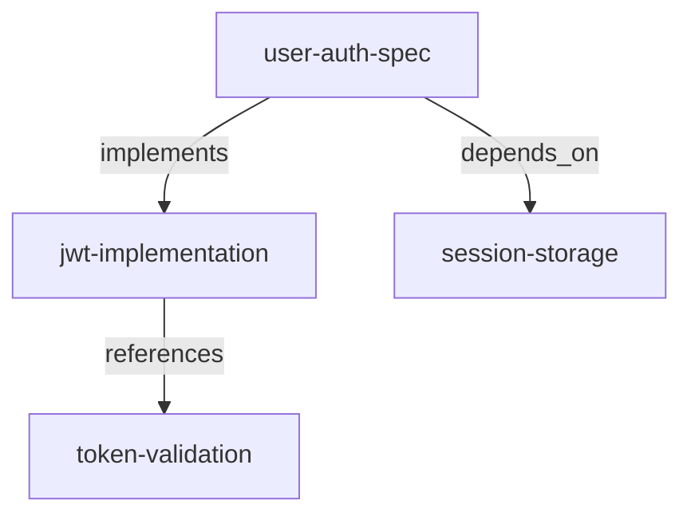

# hi-ai MCP v2.0.0: 지식 그래프 메모리 시스템

## 메이저 업데이트

v2.0.0은 hi-ai의 첫 번째 메이저 릴리스입니다. 메모리 시스템을 근본적으로 재설계했습니다.

기존에는 메모리가 독립적인 키-값 쌍으로 저장되었습니다. 서로 연관된 정보라도 각각 따로 존재했습니다. v2.0.0에서는 메모리 간 **관계**를 정의할 수 있습니다. 지식 그래프입니다.

---

## 신규 도구 6개

### 1. link_memories: 메모리 간 관계 연결

두 메모리 사이에 관계를 설정합니다.

```typescript
{
  "tool": "link_memories",
  "arguments": {
    "sourceKey": "user-auth-spec",
    "targetKey": "jwt-implementation",
    "relationType": "implements",
    "strength": 0.9
  }
}
```

**관계 유형**:
- `related_to`: 일반적인 연관
- `depends_on`: 의존 관계
- `implements`: 구현 관계
- `extends`: 확장 관계
- `references`: 참조 관계

### 2. get_memory_graph: 지식 그래프 조회

저장된 메모리들의 관계를 그래프로 조회합니다. Mermaid 다이어그램 출력을 지원합니다.

```typescript
{
  "tool": "get_memory_graph",
  "arguments": {
    "centerKey": "user-auth-spec",
    "depth": 2,
    "format": "mermaid"
  }
}
```

**출력 예시**:


### 3. search_memories_advanced: 멀티 전략 검색

5가지 검색 전략을 지원합니다.

```typescript
{
  "tool": "search_memories_advanced",
  "arguments": {
    "query": "인증",
    "strategies": ["keyword", "graph_traversal", "temporal"]
  }
}
```

**검색 전략**:
- `keyword`: 키워드 기반 검색
- `graph_traversal`: 그래프 탐색 (BFS/DFS)
- `temporal`: 시간순 검색
- `priority`: 우선순위 기반
- `context_aware`: 컨텍스트 인식 검색

### 4. create_memory_timeline: 타임라인 생성

메모리를 시간순으로 정렬하여 타임라인을 생성합니다.

```typescript
{
  "tool": "create_memory_timeline",
  "arguments": {
    "category": "auth",
    "limit": 10
  }
}
```

프로젝트의 의사결정 히스토리를 추적할 때 유용합니다.

### 5. analyze_dependency_graph: 코드 의존성 분석

프로젝트의 코드 의존성을 분석하고 순환 참조를 감지합니다.

```typescript
{
  "tool": "analyze_dependency_graph",
  "arguments": {
    "projectPath": "/path/to/project",
    "entryPoint": "src/index.ts"
  }
}
```

**출력 정보**:
- 파일 간 의존 관계
- 순환 참조 목록
- 의존성 깊이
- 고립된 모듈

### 6. get_usage_analytics: 사용 분석

hi-ai 도구 사용 통계를 조회합니다.

```typescript
{
  "tool": "get_usage_analytics",
  "arguments": {
    "period": "week"
  }
}
```

메모리 카테고리별 분포, 시간대별 활동, 그래프 연결 통계를 확인할 수 있습니다.

---

## 아키텍처 개선

### 동적 디스패치 패턴

기존 index.ts는 37개의 switch case로 도구를 라우팅했습니다. v2.0.0에서는 동적 디스패치 패턴으로 전환했습니다.

```typescript
// Before: 37개 switch case
switch (name) {
  case "save_memory": return handleSaveMemory(args);
  case "recall_memory": return handleRecallMemory(args);
  // ... 35개 더
}

// After: 동적 디스패치
const toolHandlers = {
  save_memory: handleSaveMemory,
  recall_memory: handleRecallMemory,
  // ...
};
return toolHandlers[name](args);
```

새 도구 추가 시 핸들러만 등록하면 됩니다.

### MemoryManager 확장

지식 그래프 기능을 위해 MemoryManager를 대폭 확장했습니다.

- 코드 라인: 395줄 → 823줄 (+428줄)
- 새 테이블: `memory_relations`
- 그래프 알고리즘: BFS, DFS, Union-Find

### 데이터베이스 스키마

```sql
-- 기존 memories 테이블
CREATE TABLE memories (
  key TEXT PRIMARY KEY,
  value TEXT NOT NULL,
  category TEXT NOT NULL DEFAULT 'general',
  timestamp TEXT NOT NULL,
  lastAccessed TEXT NOT NULL,
  priority INTEGER DEFAULT 0
);

-- v2.0 신규: memory_relations 테이블
CREATE TABLE memory_relations (
  id INTEGER PRIMARY KEY AUTOINCREMENT,
  sourceKey TEXT NOT NULL,
  targetKey TEXT NOT NULL,
  relationType TEXT NOT NULL,
  strength REAL DEFAULT 1.0,
  metadata TEXT,
  timestamp TEXT NOT NULL,
  UNIQUE(sourceKey, targetKey, relationType)
);
```

---

## 삭제된 도구 8개

v2.0.0에서 사용 빈도가 낮거나 다른 도구로 대체 가능한 8개 도구를 삭제했습니다.

- `search_memories` → `search_memories_advanced`로 대체
- `auto_save_context` → 자동화 제거, 명시적 저장 권장
- `restore_session_context` → `get_session_context`로 대체 (v2.1)
- `start_session` → 제거
- `break_down_problem` → `analyze_problem`으로 통합
- `think_aloud_process` → `create_thinking_chain`으로 통합
- `monitor_console_logs` → 브라우저 도구 정리
- `inspect_network_requests` → 브라우저 도구 정리

---

## 도구 현황

### 카테고리별 (34개)

| 카테고리 | 도구 수 |
|----------|---------|
| 메모리 - 기본 | 6 |
| 메모리 - 그래프 | 4 |
| 코드 분석 | 3 |
| 사고 | 4 |
| 코드 품질 | 6 |
| 계획 | 4 |
| 프롬프트 | 3 |
| 추론 | 1 |
| 분석 | 1 |
| UI/시간 | 2 |

### 변경 요약

| 항목 | v1.4.0 | v2.0.0 | 변화 |
|------|--------|--------|------|
| 총 도구 | 36개 | 34개 | -2개 |
| 메모리 도구 | 6개 | 10개 | +4개 |
| 브라우저 도구 | 2개 | 0개 | -2개 |

---

## 사용 예시

### 프로젝트 지식 구조화

```bash
# 1. 스펙 저장
save_memory("auth-spec", "JWT 기반 인증, 리프레시 토큰 지원", "spec")

# 2. 구현 저장
save_memory("auth-impl", "src/auth/jwt.ts에 구현 완료", "implementation")

# 3. 관계 연결
link_memories("auth-spec", "auth-impl", "implements")

# 4. 그래프 조회
get_memory_graph("auth-spec", depth=2)
```

### 순환 참조 탐지

```bash
# 의존성 분석
analyze_dependency_graph("/my-project", "src/index.ts")

# 결과: 순환 참조 발견
# - src/a.ts → src/b.ts → src/c.ts → src/a.ts
```

---

## 설치

### npm

```bash
npm install @su-record/hi-ai@2.0.0
```

### Smithery

```bash
npx @smithery/cli install @su-record/hi-ai --client claude
```

---

## 다음은?

v2.0.0은 메모리 시스템의 근본적인 변화입니다. 단순 저장소에서 **지식 그래프**로 진화했습니다.

v2.1.0에서는 **세션 컨텍스트 자동 주입** 기능을 추가할 예정입니다. 세션 시작 시 이전 메모리와 지식 그래프를 자동으로 로드합니다.

---

> 이전 편: [hi-ai MCP v1.4.0: 9단계 추론 프레임워크와 Gemini 프롬프팅 전략](tech-hi-ai-06.md)

**GitHub**: https://github.com/su-record/hi-ai
**NPM**: https://www.npmjs.com/package/@su-record/hi-ai
