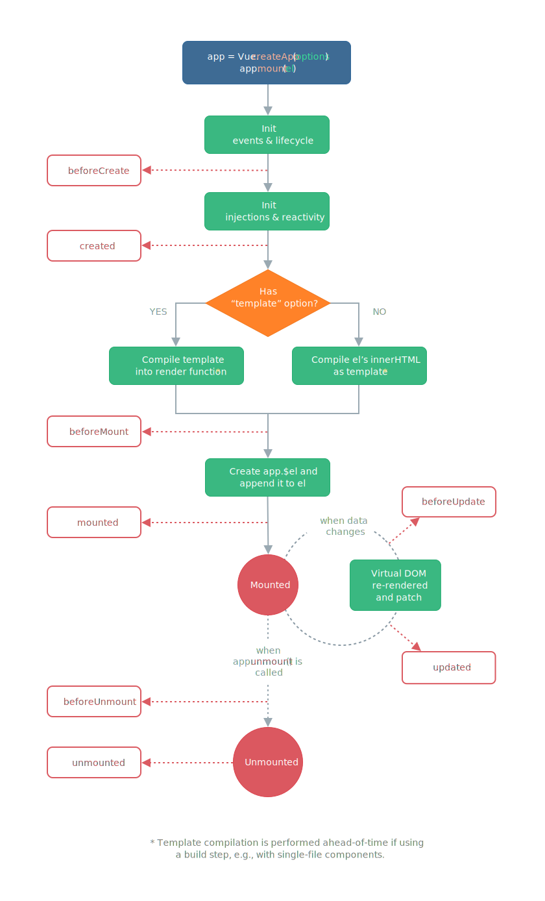

# Component
## 구조
```
<template>
// markup area
</template>

<script>
// js script area
export default {
    name: '', // 컴포넌트 이름
    components: {}, // 다른 컴포넌트를 사용 시 등록.
    data() { retrun {} }, // template, methods 에서 사용 될 변수를 등록.
    setup() {}, // 컴포넌트가 실행 되기 직전에 실행. composition api 라고 불림.
    created() {}, // 컴포넌트가 생성될 때 실행.
    mounted() {}, // 컴포넌트가 생성되고 template 가 랜더링 된 이후에 실행.
    unmounted() {}, // 컴포넌트가 종료될 때 실행.
    methods() {} // 컴포넌트 안에서 사용될 메소드를 등록.
}
</script>

<style>
// global or file only css area
</style>
```
>이런 구조를 갖게 된 이유?  
>재 사용성을 위해서 한 개의 파일이 한 개의 컴포넌트화 시켰다. 
## Life Cycle
  

1. vue instance 를 생성. (= 컴포넌트가 호출)  
   >new Vue()  
    new 앞에 function 표기가 생략된 형태다.  
    new 라는 것은 메모리에 한번만 올리겠다는 의미를 갖는다.
    instance 는 만들어져 있는 것을 메모리에 올린 상태다.

***클래스란? 데이터와 메소드 액션으로 이루어진 객체이다.  
컴포넌트와 다른 점은 컴포넌트는 생성된 자체로 기능동작이 가능하지만, 클래스는 불가능하다.***


## 랜더링 방식
>초기에 파일을 읽어서 랜더링을 완료한다.  
 이 후, template 에서 사용된 v-bind, v-on 속성에 따라 script의 data 와 methods를 업데이트 랜더링 (리랜더링)한다.  

---
click

