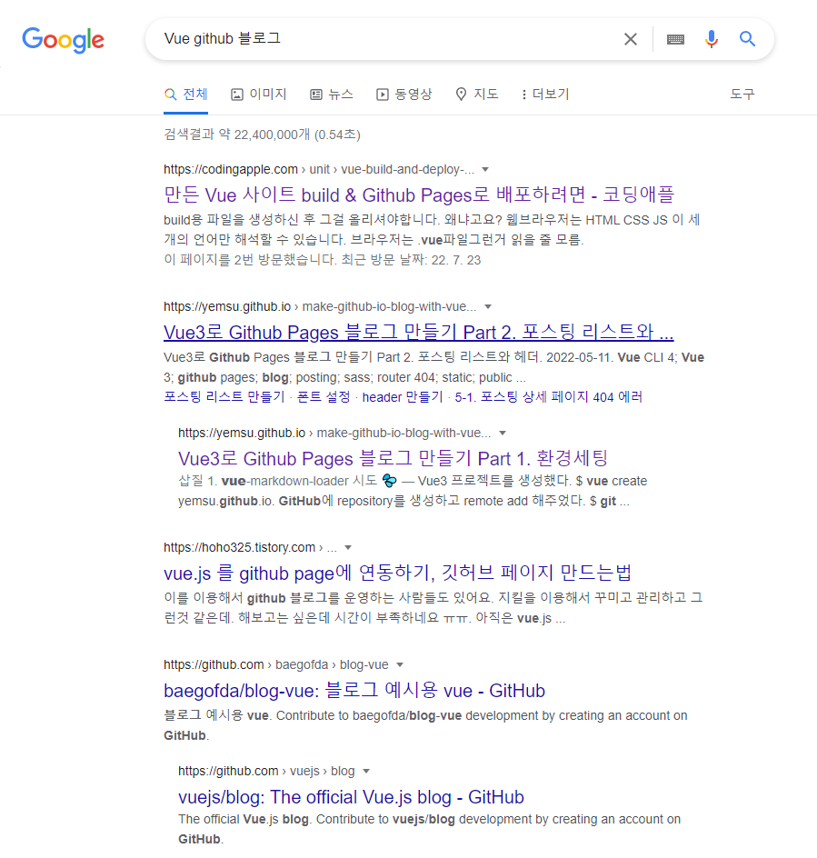
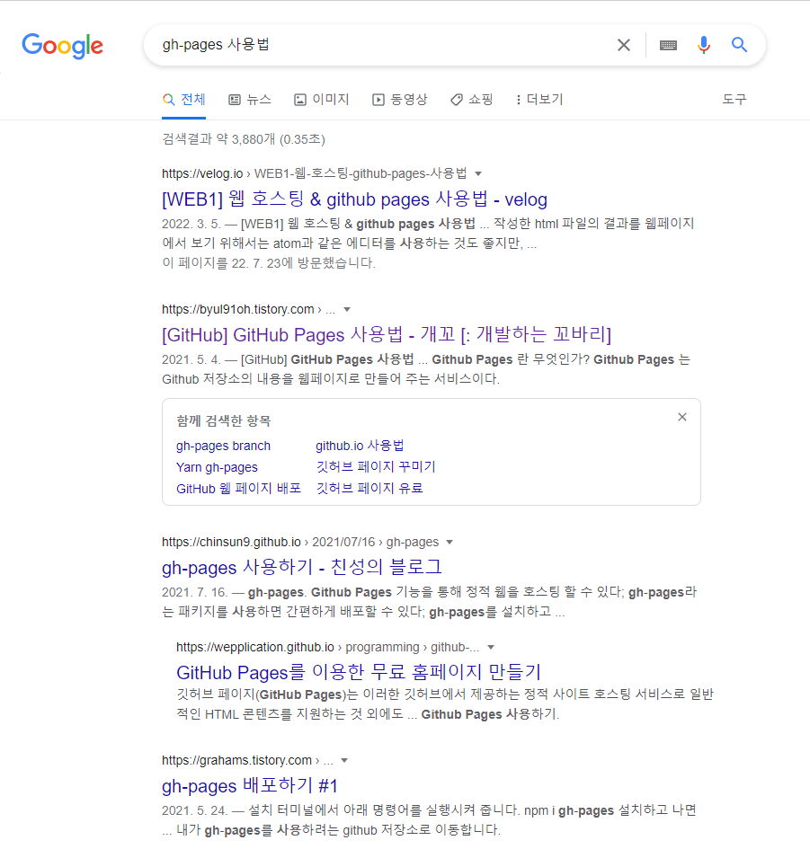
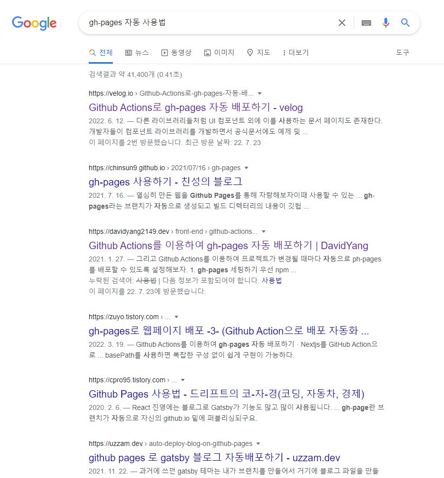
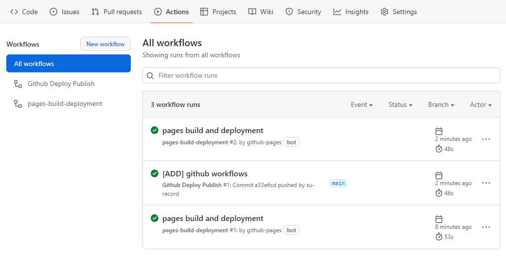
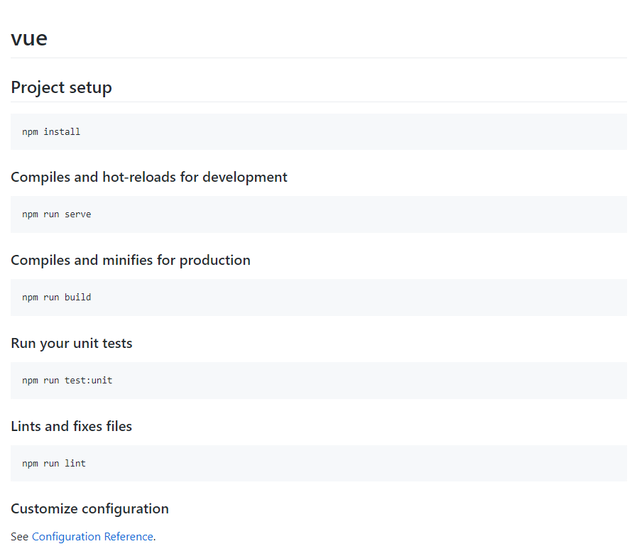
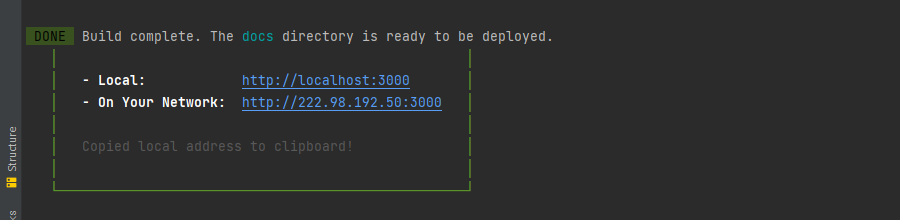
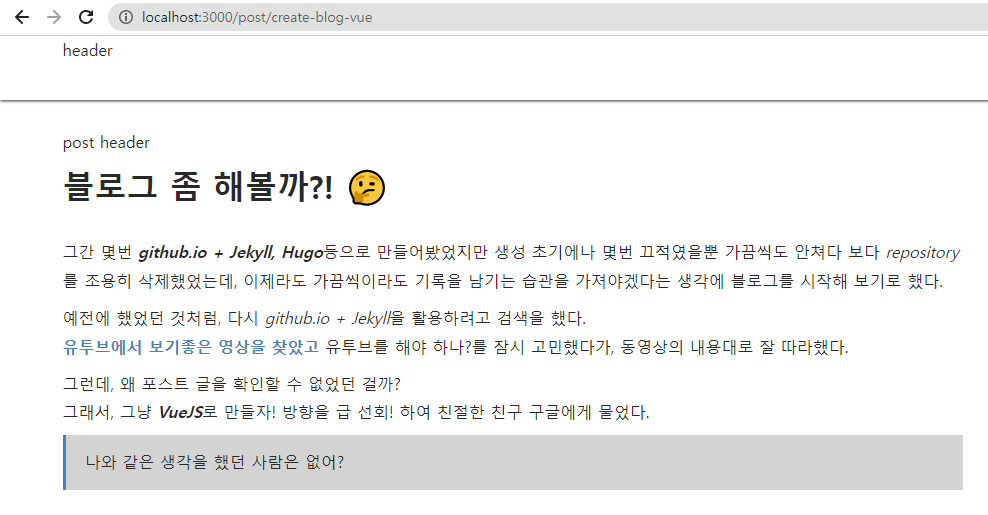

## 블로그 좀 해볼까?! 🤔    
그간 몇번 ***github.io + Jekyll, Hugo***등으로 만들어봤었지만 생성 초기에나 몇번 끄적였을뿐 가끔씩도 안쳐다 보다 *repository*를 조용히 삭제했었는데, 이제라도 가끔씩이라도 기록을 남기는 습관을 가져야겠다는 생각에 블로그를 시작해 보기로 했다.  

예전에 했었던 것처럼, 다시 *github.io + Jekyll*을 활용하려고 검색을 했다.  
**[유투브에서 보기좋은 영상을 찾았고](https://www.youtube.com/watch?v=ACzFIAOsfpM)** 유투브를 해야 하나?를 잠시 고민했다가, 동영상의 내용대로 잘 따라했다.  

그런데, 왜 포스트 글을 확인할 수 없었던 걸까?  
그래서, 그냥 ***VueJS***로 만들자! 방향을 급 선회! 하여 친절한 친구 구글에 도움이 필요했다.  

>나와 같은 생각을 했던 사람은 없어?  

 

검색된 결과가 아주 만족스럽게 많았다. ㅋㅋㅋ  
그 중에 **[Vue3로 Github Pages 블로그 만들기 Part 1. 환경세팅](https://yemsu.github.io/make-github-io-blog-with-vue3-1/)** 글을 참고해서 블로그 만들기를 시작했다.
>아주 자세한 내용 감사합니다. 🤩  

이 블로그를 따라한 결과가 지금 보고 있는 포스트이다.  
하지만, 배포에 대한 내용을 찾아볼 수 없어서 다시 구글에 도움을 요청!

>정답을 알려줘! 

 

훌륭한 분들이 참 많다. 👍  
이 게시글들을 읽어보다가 ***자동***으로도 되는거 아닌가? 🙄  

  

매우 칭찬합니다~! 👏  
여러 글들을 읽어보고 최종적으로 **[Github Actions로 gh-pages 자동 배포하기 - velog](https://velog.io/@kdeun1/Github-Actions%EB%A1%9C-gh-pages-%EC%9E%90%EB%8F%99-%EB%B0%B0%ED%8F%AC%ED%95%98%EA%B8%B0)** 이 글을 내용을 따라서 적용했다.

## 드디어 배포!!! 🙏  
  
Repository > Actions 메뉴에서 작업한 내용이 처리되는 상황을 볼 수 있다.  
완료가 잘 되었기에 드디어 나의 블로그를 보는구나 했지만, ***README.md*** 내용만 보게됐다.



🤬🤬🤬🤬🤬💢  
***도대체 왜!!?***  
혹시? 빌드된 소스에 문제가 있는걸까?
```
npm run build
```

```
npm i -g serve
serve -s dist
```


잘 나온다. 아주 잘.... 😡  

다시 구글에서 검색을 하고, 왠만한 게시글을 다 읽어본 듯 했다.  
다양하게 전달받는 내용대로 적용해 보았지만, 내 블로그는 나타나지 않았다.  
그러다 검색의 범위를 유투브로 옮겼다.  
그리고... 결국 찾았다. 😭  
***[Vuejs Github Action & Github Page](https://www.youtube.com/watch?v=KEA3baRtsKA&t=445s)***  
어느 나라 사람인지, 어떤 사람 인지 전혀 모르는 그냥 이 지구 어딘가 계시는 **Webci Yasin** 너무 고맙습니다.💕  

## 완성! ✨  
***VueJS를 기반으로 마크다운으로 글쓰기를 할 수 있고, git repository gh-pages로 자동으로 배포되는 블로그가 완성됐다.***  

이번에는 삭제하지 않도록, 한 주에 한번씩이라도 글을 기록해야겠다.

---
## 참고 📚  
- 테디노트 **<https://www.youtube.com/watch?v=ACzFIAOsfpM>**
- 블로그 만들기 참고 **<https://yemsu.github.io/>**
- Github Actions로 gh-pages 자동 배포하기 **<https://velog.io/@kdeun1/Github-Actions%EB%A1%9C-gh-pages-%EC%9E%90%EB%8F%99-%EB%B0%B0%ED%8F%AC%ED%95%98%EA%B8%B0>**
- Webci Yasin **<https://www.youtube.com/watch?v=KEA3baRtsKA&t=445s>**