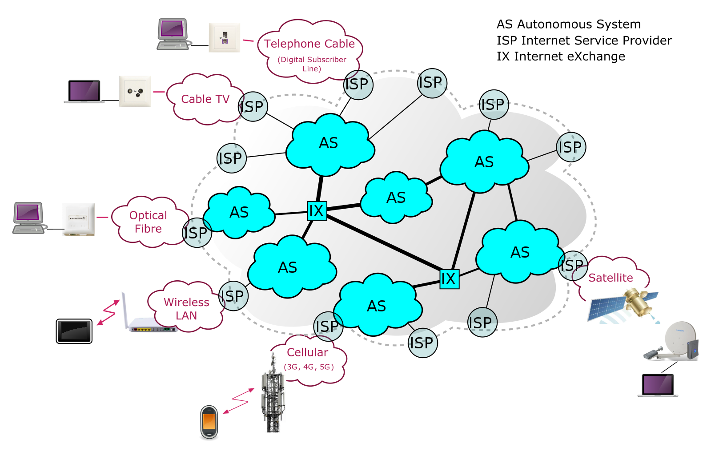
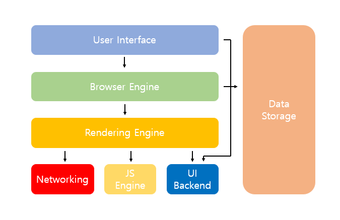

## Browser
브라우저의 주요 기능은 사용자가 선택한 자원을 서버에 요청하고 브라우저에 표시하는 것이다.  
자원은 주로 HTML, CSS, Javascript의 코드로 작성된 문서이지만 PDF나 이미지 또는 다른 형태일 수 있다. 자원의 주소는 URI(Uniform Resource Identifier)에 의해 정해진다.


### 주소창에 URL을 입력
1. 브라우저가 URL을 해석해서 원격지에서 조회할 웹 서버와 파일명, 포트번호(default 80)를 판단하고 실제 HTTP 메세지 포맷에 맞게 GET request 메세지를 작성할 준비를 한다. (브라우저가 크롬인 경우 브라우저 애플레이션의 최상휘 프로세스인 브라우저 프로세스의 UI 스레드가 주소창에 입력된 입력값이 URL인지 검색어인지 검사함.)
2. URL에서 해석한 정보를 바탕으로 해당 지원을 취할 수 있고, HTTP 메세지 포맷에 맞는 상태라인, 헤더, 바디를 가지고 있는 GET request 메세지를 작성한다.
3. 브라우저가 DNS 요청을 OS에 의뢰하고 실행한다.
    >DNS(Domain Name System)는 도메인 이름(www.amazon.com)을 머신이 읽을 수 있는 IP 주소(192.0.2.44)로 변환한다.  
   각종 기기들로 부터 인터넷상의 모든 컴퓨터는 숫자를 사용하여 서로를 찾고 통신한다. 이런 숫자를 IP 주소라고 하며 웹사이트 이동을 위해 필요하지만 IP 주소를 입력할 필요는 없다. 도메인 이름을 입력해도 DNS로 원하는 웹사이트로 이동할 수 있기 때문이다. 인터넷의 DNS는 도메인과 IP간의 매핑을 관리하며 마치 전화번호부와 같은 기능을 한다.  
    DNS 요청의 프로토콜을 UDP이고, DNS 서버의 IP주소는 컴퓨터의 TCP/IP 설정 항목 중 하나라 OS가 이미 알고 있다. 엑세스 대상의 웹서버가 DNS에 등록되어 있으면 IP주소를 포함한 응답이 오고, 응답은 OS의 DNS 리졸버가 내용을 해석한 후 IP 주소를 추출하여 메모리에 저장하고 브라우저의 프로세스가 접근 할 수 있게 한다.  
    ***브라우저는 직접 네트워크 요청을 할 수 없다. DNS 요청을 포함한 모든 네트워크 요청은 OS에 의뢰해서 진행한다.***

4. 브라우저가 OS의 프로토콜 스택에 메세지 송신을 의뢰하고 소켓을 작성한다.
    >TCP/IP에 사용되는 프로토콜 스택의 실제 구현체는 OS단에 존재한다.
    >소켓은 두 단말의 통신 동작을 제어하기 위한 제어 정보의 총체이며, 통신 제어 정보를 기록하는 메모리 영역을 가리키는 말이기도 하다.  
    >클라이언트에서는 DNS조회르 IP주소를 알아내면 지정된 포트 번호는 서버측 컴퓨터의 프로세스를 특정하기 때문에 서버측 컴퓨터의 어떤 소켓과 접속할지를 지정할 수 있다.  
    >통신 종단점의 두 소켓은 파이트로 읽기 쓰기 동작을 거듭하며 데이터를 주고받게 되고, OS에서는 소켓이 만들어지면 메모리 영역을 화곱하고, 고유한 파일 디스크럽터를 통해 소켓을 식별하게 된다.

5. TCP 프로토콜 스택은 Three-Way Handshake를 통해 서버와 연결 수립
    >SYN, ACK 비트를 주고 받으면 각 단말이 통신이 가능한 상태인지 확인한다.  
     클라이언트에서 SYN 비트를 만들어 서버로 연결 메세지 전송.  
     서버가 요청을 수락하면 SYN 비트와, ACK 만들어 브라우저로 재전송.  
     서버에서 돌아오는 프로세스에서 SYN이 처음 보냈던 비트값이면 접속 성공으로 소켓의 서버 IP 주소나 포트번호등과 함께 소케에 접속 완료를 나타내는 제어 정보를 기록하고 패킷을 받았다는 것을 알리기 위해 ACK 비트를 만든 TCP헤더를 반송한다.
     * 만약 통신 프로토콜이 https라면 ***https(TLS) Handshake를 TCP Handshake에 이어서 진행한다.***

6. TCP 프로토콜 스택에서 패킷을 만들고 TCP 헤더를 붙인다.
    >여기서부터는 OSI 4계층, 전송 계층의 시작점이다.  
     핸드쉐이크를 통해 접속이 성립되었으면 서버로 보내야 하는 데이터(HTTP 메세지)를 TCP로 보낼 수 있는 최대치(MSS)에 맞춰 데이터를 알맞게 자르고 자른 데이터들마다 TCP 헤더를 붙여 몇번째 데이터인지 등등 제어 정보(TCP 헤더)를 덧붙여서 첫번째로 데이터를 조각내 패킷을 만든다.  
     TCP 헤더의 주요한 정보들로 송수신처의 포트 번호, 데이터 오프셋(데이터의 시작지점), ACK번호, 6비트짜리 컨트롤 비트(URG, ACK, FIN, SYN, PSH, RST)가 있다.

7. IP 프로토콜 스택은 패킷을 더 잘게 나누고 원격지의 MAC 주소를 기반으로 MAC 헤더를 붙인다.
    >단말이 소통하려면 IP주소 뿐 아니라 단말이 가진 네트워크 인터페이스(LAN 카드)의 고유한 MAC 주소가 필요하다.  
     ARP(Address Resolution Protocol)는 IP 주소를 기반으로 MAC 주소를 알아오는 역할을 하며, 같은 네트워크 내부에서 브로드캐스트로 요청을 보내서 원격지 서버가 네트워크 내부에 있으면 해당 단말의 MAC 주소를, 외부에 있으면 네트워크 라우터의 MAC 주소를 가져온다. 알아낸 주소를 토대로 MAC 헤더를 패킷들마다 만들어 붙인다.

8. LAN 어댑터를 통해 바이너리 데이터를 전기신호로 바꾼다.
    >송신측에서 패킷 읽을 타이밍을 잡을 때 쓰는 프리앰블 비트, 패킷의 개시 위치가 어디서부터인지를 알게 해주는 비트, 패킷 오류 검출을 위한 FCS 비트등 데이터를 추가하여 2진 데이터를 전기신호로 바꾼다.

9. 원격지의 MAC 주소로 전기 신호를 송출한다.
    >데이터가 집 밖으로 나가는 순간 원격지가 대역폭이 다른 외부 네트워크라면 패킷을 네트워크의 라우터로, 대역폭이 같은 내부 네트워크라면 해당 원격지로 전송된다.


10. 패킷의 목적지가 외부 네트워크이면 네트워크의 라우터에 패킷이 도달한다.
    >라우터에 도착한 패킷은 연결된 포트를 통해 다른 네트워크에 존재하는 원격지 MAC 주소를 알아내기 위해 ARP를 원격지에 요청하고 라우팅 테이블을 뒤져서 패킷을 중개하기 위환 경로를 탐색하고 전기 신호를 송신한다.

11. 엑세스 회선, 인터넷 접속용 라우터를 통과하여 인터넷의 내부로 중개횐다.
    >라우터를 나간 패킷은 인터넷 엑세스 회선을 통과하며 장거리 통신에 적합한 형태로 변형되고, 추가적인 제어 정보를 붙여 인터넷에 내부로 중계된다. (엑세스 회선의 종류에 따라 FTTH 회선을 쓸 경우 광섬유, 광통신에 알맞는 형태로 변형된다.)  
     전기 신호는 건물의 옥내 배선을 지나 전신주의 케이블로 들어가고 통신사 전화국으로 들어간후 인터넷 접속용 라우터를 거쳐 인터넷의 내부로 중계되기 시작한다.


12. 인터넷 내부의에서의 패킷 흐름
    <p style="text-align: center">
        
        <a href="https://commons.wikimedia.org/wiki/File:Structure_of_the_Internet.svg">https://commons.wikimedia.org/wiki/File:Structure_of_the_Internet.svg</a>
    </p>
    <br />
    >인터넷은 한 개의 조직이 운영하는 단일 네트워크가 아니라 다수의 프로바이더(인터넷 사업자)가 서로 연결되어 있는 것이다. 따라서, 여러 프로바이더의 여러 라우팅 장비들을 거치면서 최종적으로 목적지 서버가 포함된 네트워크 라우터를 거쳐 해당 목적지 웹 서버의 단말로 패킷이 도착한다.

13. 웹 서버로 전기 신호가 도착한 이후에 동작
    >전기 신호를 받은 웹 서버는 네트워크 계층을 올라가면서 전기 신호를 조각난 패킷과 헤더 정보를 바탕으로 클라이언트에서 발송한 데이터를 재조립하는 디캡슐레이션 동작을 한다.

14. 서버 어플리케이션은 완성된 요청 메세지를 받고, 응답 메세지를 작성한다.
    >요청 URI를 실제 서버의 파일 시스템에서의 URI로 바꿔서 해당되는 html 자원을 찾아 바디에 넣어 리스폰스 헤더와 함께 응답 메세지를 작성한다.  
    >엔드포인트와 웹서버의 디렉토리는 차이가 있을 수 있기에 서버에서 올바르게 찾아는주는 과정이 필요함.

15. 응답 메세지를 받은 클라이언트 브라우저의 동작
    >브라우저는 HTTP 메세지의 content-type 헤더를 보고 응답 데이터가 html 임을 알아내고 화면 표시 동작을 실행한다.(화면 표시는 브라우저 프로세스의 렌더러 스레드가 담당)  
    >HTML을 파싱하며 CSS, JS, 이미지등 HTML 이외의 자원들을 서버에서 받아서 ***Critical Rendering Path***를 거치며 CSS를 적용하고 JS를 해석, 실행시키면서 완성된 웹 페이지를 브라우저에 띄운다.

16. 요청이 종료되면, 4-Way-Handshake를 통해 접속을 끊고 소켓을 말소한다.

    >데이터 송수신 과정이 끝나면 접속을 끊기 위해 4-Way-Handshake를 실시한다.  
     HTTP 1.1부터 도입된 keep-alive 때문에 요청이 끝났더라도 바로 커넥션이 종료되지 않는게 일반적이며, keep-alive timeout 설정이 지나고 난 후에 서버-클라이언트간 접속이 끊어지고, 소켓이 만료된다.


### 브라우저 구조
<p style="text-align: center"></p>

- **사용자 인터페이스** : 주소 표시줄, 이전/다음/새로고침 버튼 등, ***웹 페이지를 제외***하고 사용자와 상호작용을 위해 접근할 수 있는 영역
- **브라우저 엔진** : 사용자 인터페이스와 렌더링 엔진 사이의 동작을 제어
- **자료 저장소** : 자료를 저장하는 계층으로 localStorage, index DB, cookie 등 브라우저 메모리를 활용하여 데이터를 저장하는 영역
- **렌더링 엔진** : 브라우저의 핵심으로 요청한 웹 페이지의 콘텐츠 HTML과 CSS를 해석하여 화면 표시하는 엔진
- **네트워킹** : HTTP 요청 같은 네트워크 요청을 수행하는 파트이며 브라우저마다 독립적인 인터페이스를 갖고 있다.
- **자바스크립트 해석기** : 자바스크립트 코드를 해석하고 실행한다.
- **UI 백엔드** : OS 사용자 인터페이스 체계를 사용하여 체크박스나 버튼과 같은 기본적인 위젯을 그려준다.

>웹 브라우저는 각각의 다른 렌더링 엔진을 사용하고 있다.<br>
>Safari: Webkit / Firefox: Gecko / Chrome: Blink

### 렌더링 엔진의 목표
- 요청받은 내용을 화면에 표시한다.
    >HTML 및 XML문서와 CSS, Javascript, 이미지를 표시할 수 있고, 플러그인이나 브러우저 확장 기능을 이용해 PDF와 같은 다른 유형도 표시할 수 있다.

- 업데이트가 필요할 때, 효율적으로 렌더링을 할 수 있도록 자료 구조를 생성한다.

### 렌더링 엔진 동작 과정 (Critical Rendering Path)
렌더링 엔진은 요청한 문서의 내용을 얻는 것에서 시작하며, 문서는 보통 8kb 단위로 전송된다.  

<p style="text-align: center"></p>

1. #### DOM Tree

    브라우저에서 사용자가 요청한 웹페이지 HTML문서를 파싱하여 DOM 노드를 만들어서 병합하여 DOM Tree를 생성한다.
    
    - **Parser**
   
     파싱은 서버로부터 전송받은 문서의 문자열을 브라우저가 이해할 수 있는 구조로 변환하는 과정을 말한다. 파싱 결과는 문서 구조를 나타내는 노드 트리이며, 파싱 트리(parse tree) 또는 문법 트리(syntax tree)라고 한다.
        - 변환(Conversion): HTML의 원시 바이트(raw bytes)를 읽고 해당 파일에 지정된 인코딩(UTF-8 등)에 따라 문자열로 변환하는 과정
        - 토큰화(Tokenizing): 문자열을 [W3C HTML5 표준](https://html.spec.whatwg.org/multipage)에 따라 고유 토큰(<html>, <body>등, 꺽쇠괄호로 묶인 문자열)으로 변환합니다. 각 토큰은 특별한 의미와 고유한 규칙을 가진다.
        - 렉싱(Lexing): 토큰을 해당 속성 및 규칙을 정의한 객체(Nodes)로 변환한다.
        - DOM 생성(Dom construction): HTML은 상위-하위 관계로 정의할 수 있어, 트리 구조로 나타낼 수 있다. 렉싱 과정을 거쳐 생성된 노드들을 트리 구조로 변환한다.

        >위의 4가지 과정을 거치면 트리형태의 DOM이 만들어지고, 브라우저는 이후 모든 페이지 처리에 이 DOM을 사용한다.

    - **Javascript 처리**
   
      자바스크립트는 파서 차단 리소스(parser blocking resource)입니다. 브라우저는 HTML문서를 파싱 하다가 자바스크립트를 만나면 진행하던 파싱을 중지하고 자바스크립트 엔젠에게 권한을 넘겨 자바스크립트를 파싱하고 실행한다.  
      자바스크립트가 실행되는 동안 문서의 파싱은 중단되기 때문에 자바스크립트를 <head> 태그가 아닌 <body> 태그가 닫히기 바로 전에 선언하는 것이 좋다.  
      ```<script defer>```를 사용하면, 문서 파싱이 완료된 이후에 자바스크립트가 실행된다. HTML5에서는 비동기(async)로 처리하는 속성이 추가 되었고, 자바스크립트가 별도의 맥락에 의해 파싱되고 실행된다. ([async와 defer](https://beomy.github.io/tech/browser/async-defer/))

2. #### CSSOM Tree

     DOM을 생성하는 과정 그대로 CSS는 CSSOM을 생성한다.   
     브라우저는 DOM을 생성하는 동안 외부 CSS를 참조하는 **<link>**태그를 만나게 되면 브라어주에 리소스를 요청한다. CSS의 원시 바이트가 문자열로 변환된 후 차례로 토큰과 노드로 변환되고 마지막으로 CSSOM(CSS Object Model)이라는 트리 구조를 만든다.
     CSSOM는 DOM이 화면에 어떻게 표시될지를 알려주는 역할을 한다.
     - CSS는 렌더링 차단 리소스(render blocking resource)이고 렌더링 할 때 반드시 필요한 리소스라서 브라우저가 빠르게 다운로는 하기 위해 <head> 태그 안에 정의한다.
     - CSS는 DOM 트리를 변경하지 않기 때문에 문서 파싱을 기다리거나 중단할 이유가 없으나, 자바스크립트에서 스타일 정보를 요청하는 경우에 CSS가 파싱되지 않은 상태라면 스크립트 에러가 발생할 수 있다.

3. #### Render Tree

     화면에 표시되어야할 모든 노드들의 콘텐츠, 스타일 정보를 포함하고 있는 트리이다.  
     렌더링 엔진이 DOM Tree의 document 객체부터 각 노드들을 순회하면서 각각에 맞는 CCSOM을 찾아서 규칙을 적용하면서 렌더와 관련된 요소들을 렌더트리에 포함시키는데, head 태그 같은 비시각적 DOM 요소와 display: none 속성을 가진 요소들은 렌더 트리에 포함되지 않는다. (visibility: hidden 은 포함된다.)  
    즉, Render Tree는 렌더링 엔진이 DOM Tree와 CSSOM Tree가 합쳐서 만드는 결과물이다.

4. #### Layout(Reflow)

     뷰포트 내에서 요소들의 정확한 위치와 크기를 계산하는 과정으로 박스모델에 따라서 텍스트나 요소의 박스에 적용된 스타일 속성이 계산된다.  
     이때, %, em같은 상대적인 단위를 사용했을 때는 뷰포트에 맞춰서 픽셀단위로 변환된다.

5. #### Painting

     렌더링 엔진이 레이아웃 과정통해 알게된 요소들의 계산된 내용을 화면에 실제 픽셀로 그려지도록 변환하는 과정

***렌더링 동작 과정(Critical Rendering Path)의 시간을 줄이면 브라어저가 웹 페이지를 보여 주는 데 걸리는 시간도 줄일 수 있다.***


### UI 업데이트
1. **Layout(Reflow)** (Layout이 발생되는 경우)
    >사용자 조작 > 화면 변경 > Layout > Paint > Composite (레이어 합성)

   요소의 크기, 위치, 브라우저창 크기가 바뀔 때 발생

2. **Painting(Repaint)** (Paint부터 발생되는 경우)
    >사용자 조작 > 스타일만 변경 > Paint > Composite

     주로 배경 이미지, 텍스트 색상, 그림자등 레이아웃 수치에 변화를 주지 않는 스타일의 변경만 일어났을 때 발생  
     레이아웃 과정이 발생하지 않기 때문에 Reflow에 비해 성능상 이점을 가진다.


3. ***레이어의 합성***만 다시 발생하는 경우
    >사용자 조작 > 스타일 변경 > Composite

     Layout과 Paint 과정을 수행하지 않고 레이어의 합성만 발생하기 때문에 성능상으로 가능 큰 이점을 가진다.

- ***[http://csstriggers.com](http://csstriggers.com)에서 css 속성이 변경되면 위 3가지 유형중 어떤 경우로 업데이트 되는지 확일할 수 있다.***

- **레이어 합성?**

     레이어는 포토샵의 레이어와 비슷하게 페인팅할 영역을 나누어 놓는 것을 의미하며 크롬의 경우 레이아웃 과정 이후에 정해진 기준이나 필요에 의해서 브라우저가 레이어를 생성하고, 렌더 트리에 있는 노드 객체들은 생성된 레이어 포함된다. 레이어들은 트리 형태로 구성되고 렌더링 엔진이 각 레이어를 페인팅 과정에서 각각 그려준 다음 하나의 비트맵으로 합성해서 페이지를 완성한다.

***브라우저 렌더링 방식을 통해 알 수 있는 것은 CSS 속성을 사용할 때도 성능 영향에 대한 고민이 필요하다.***

### 참고
- [https://maxkim-j.github.io/posts/packet-travel](https://maxkim-j.github.io/posts/packet-travel)
- [https://d2.naver.com/helloworld/59361](https://d2.naver.com/helloworld/59361)
- [https://beomy.github.io/tech/browser/browser-rendering/](https://beomy.github.io/tech/browser/browser-rendering/)
   