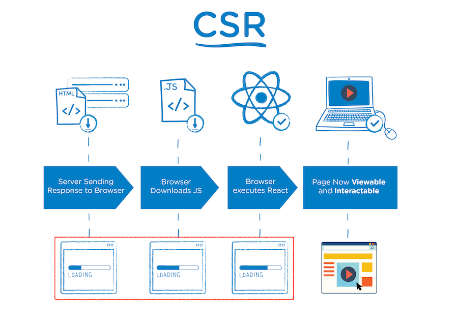

## CSR/SSR, SPA/MPA, PWA
렌더링방식에 대해 알아보기.

### CSR(Client Side Rendering) || SSR(Server Side Rendering)
브라우저 화면을 그리는데 주도권이 어디에 있냐에 따라서 CSR과 SSR로 렌더링 방식이 나뉜다.  
전통적인 방식으로 웹 개발을 하는 환경에 있는 분들은 ? 가 생길 수 있다. CSR, SSR이라는 개념 자체는 오래됐지만, 본격적으로 거론되기 시작한 것은 Javascript 기반의 웹 프레임워크들이 프론트개발에 주도적인 위치를 갖게 되는 시점부터다. (Angular, React, Vue 등)
```html
<body>
    <div id="app"></div>
</body>
```
JS 기반 웹 프레임워크들의 index.html 파일을 보면 위와 동일한 형태를 갖고 있다.  
실제로 최초 다운로드 받는 html 문서는 이 뼈대만 받게되며, 나머지는 js 파일의 로직을 통해서 마크업을 작성하고 DOM에 더하여 그리기 때문이다.
```html
<body>
    <div id="app">
        <header></header>
        <main></main>
    </div>
</body>
```
브라우저를 통해 확인할 수 있는 마크업 형태는 콘텐츠와 각각의 요소들을 모두 가지고 있는 형태가 된다. 따라서, 뼈대만 다운로드하고 이후 브라우저(Client)에서 **동적**으로 DOM을 그리는 방식을 CSR방식으로 부르고, 처음부터 콘텐츠와 각각의 요소가 만들어진 HTML문서를 다운받는 방식을 SSR방식이라 한다.

- #### CSR (Client Side Rendering)
  <p style="text-align: center">
    
    <a href="https://medium.com/walmartglobaltech/the-benefits-of-server-side-rendering-over-client-side-rendering-5d07ff2cefe8">The Benefits of Server Side Rendering Over Client Side Rendering
    </a>
  </p>

    각각의 프레임워크에서 작업을 하고 빌드한 결과물을 서버에 업로드 하게 되면 웹 서버는 브라우저가 웹 사이트 리소스를 요청할 때 업로드 된 파일을 전달만 해줍니다. 이후 브라우저에서 다운로드한 JS파일을 실행하면서 DOM에 내용을 추가하며 그립니다.  
    초기에 JS 파일을 읽어서 무엇을 그려야 할지를 판단하고, 그리는 작업을 하는 동안 딜레이가 발생하지만 초기 화면이 그려지고 난 이후에는 페이지 전환을 브라우저에서 하기 때문에 빠른 화면 전환과 인터랙션이 가능해집니다.
    
- #### SSR (Server Side Rendering)