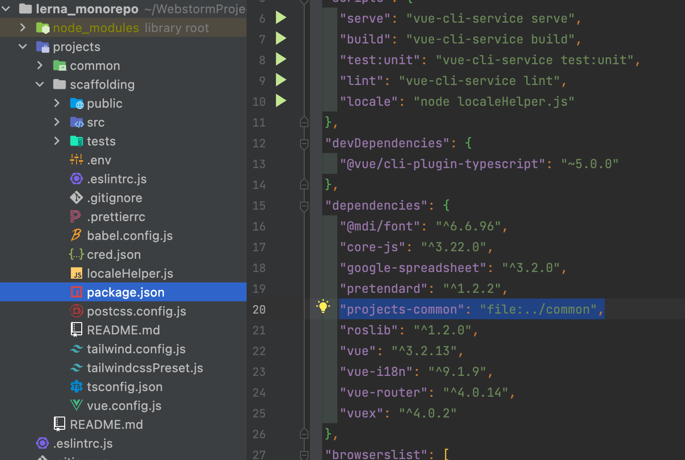

# 공통 코드 Dependency

>콤포넌트나 상수, 인터페이스, 타입등 한번 작성하면 수정하지 않는 재사용 가능한 코드들을 관리하기 위해 common 프로젝트에 만들고, 다른 프로젝트의 package.json에 dependencies에 등록하여 패키지처럼 사용을 하는 상황에서, 새로 작성한 파일이 import 되지 않을 수 있다.  
>이는 의존성이 주입될 때의 환경이 아니기 때문이며, 새롭게 lerna bootstrap을 하면된다. 이때 주의할 것은 package-lock,json 이나 yarn.lock 파일이 있다면 먼저 이 파일들을 삭제해야 한다.

