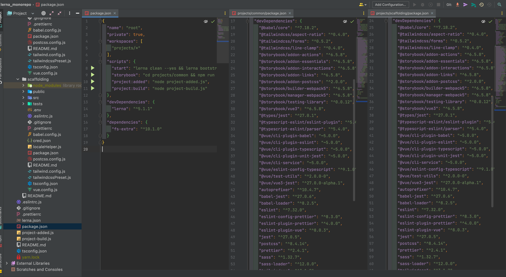
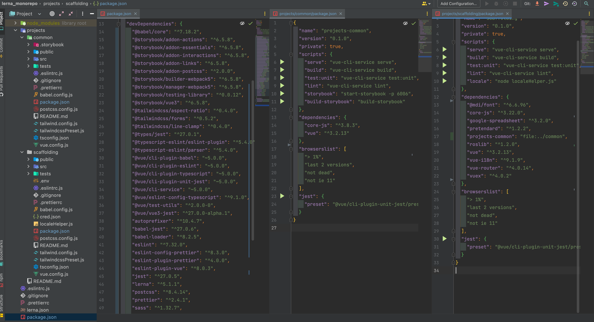
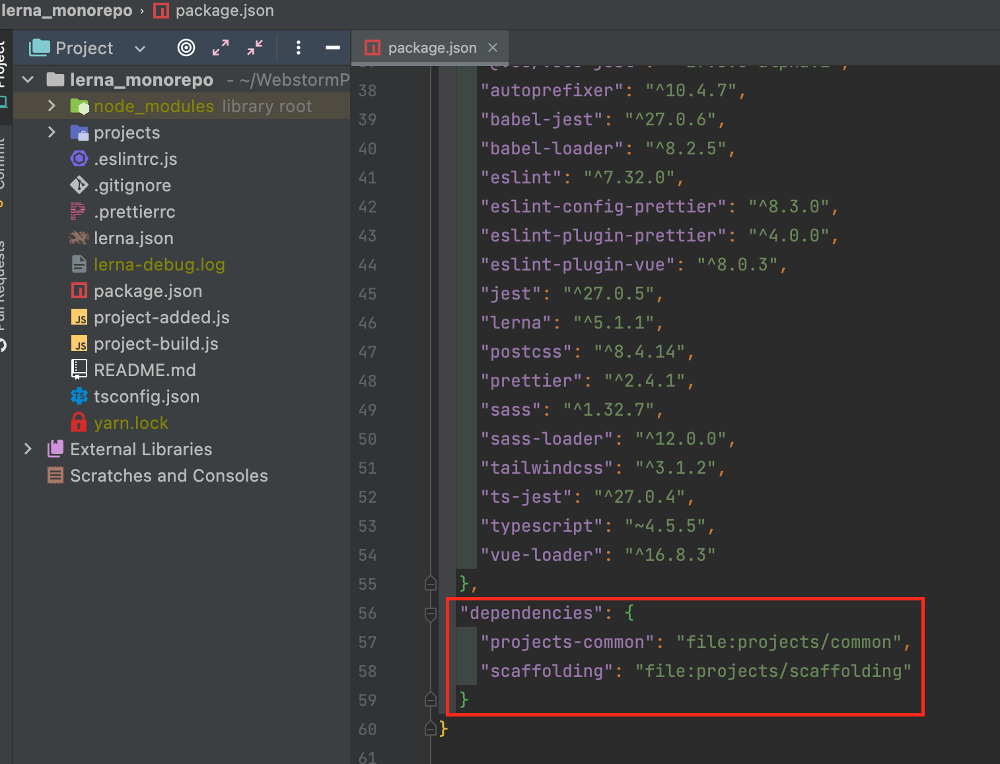
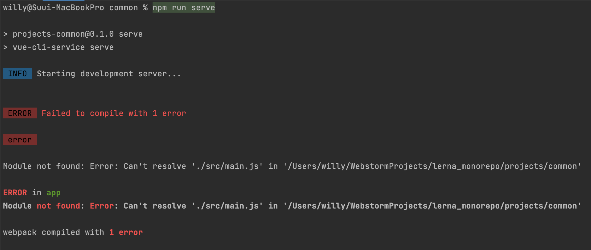
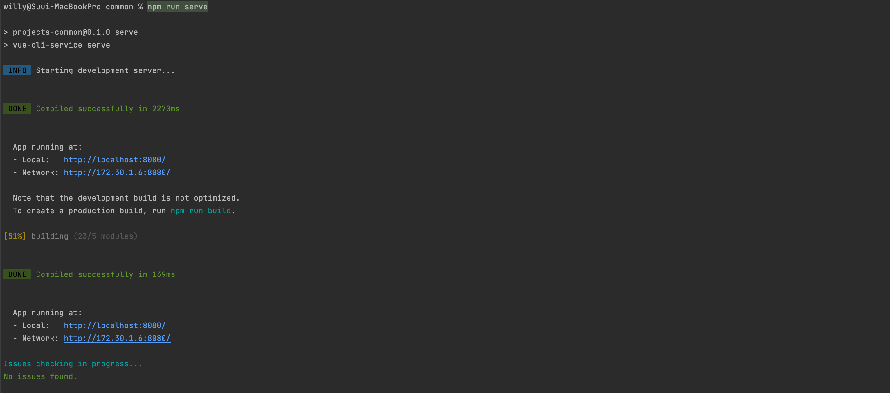

# Link Convert
>```lerna link convert``` 명령어를 통해 각 프로젝트의 dev dependencies를 root로 모을 수 있다.  

- 각 package.json 파일


- ```lerna link convert``` 실행 후 각 package.json 파일


>각 package.json 파일의 dev dependencies가 root package.json 파일로 옮겨졌으며 dependencies에 프로젝트가 추가된다.  
>lerna clean 과 lerna bootstrap을 실행하면 각 프로젝트의 node_module 폴더도 사라지는 것을 확인할 수 있다.  
>  
>root 폴더 위치에서 ```lerna run --scope project-common serve``` 나 project 폴더에서 ```npm run serve``` 등 script를 실행할 수 있다.  
>하지만, root 폴더에서 lerna 명령어로 실행을 하면 터미널 창에서 에러를 확인할 수 없기 때문에 root package.json 에 스크립트를 추가하거나 project 폴더에서 ```npm run serve``` 를 통해 실행하는 것을 추천한다.  
>```lerna link convert```가 잘 실행됐고, script를 실행했지만, Vue-CLI로 create 하고 타입스크립트를 차용하는 vue 환경에서는 에러가 발생할 수 있다.



>이 에러는 *.ts 파일을 *.js 파일로 컴파일 해줘야 하는 패키지가 root로 이동을 하여 현재 위치에서 ts 파일을 컴파일 할 수 없기 때문에 발생하는 에러이다.  
>따라서, 현재 실행되는 프로젝트 폴더의 package.json에 ts 컴파일 패키지를 dev dependencies로 추가해주고 ```lerna bootstrap``` 해주면 해결할 수 있다.
```
// project/.../package.json
{ ...
  "devDependencies": {
    "@vue/cli-plugin-typescript": "~5.0.0"
  },
  ...
}
```



