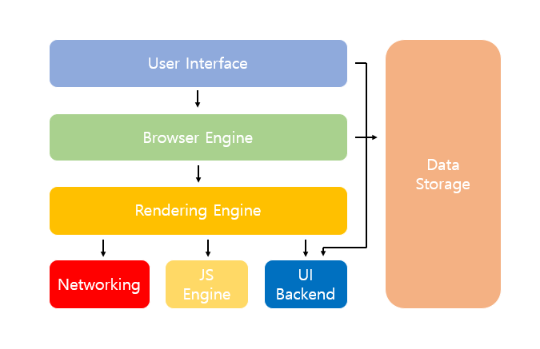

웹 브라우저는 HTML, CSS, Javascript 로 작성된 코드를 웹 페이지를 그려준다.  

## 브라우저 구조

- **사용자 인터페이스** : 주소 표시줄, 이전/다음/새로고침 버튼 등, ***웹 페이지를 제외***하고 사용자와 상호작용을 위해 접근할 수 있는 영역
- **브라우저 엔진** : 사용자 인터페이스와 렌더링 엔진 사이의 동작을 제어
- - **자료 저장소** : 자료를 저장하는 계층으로 localStorage, index DB, cookie 등 브라우저 메모리를 활용하여 데이터를 저장하는 영역
- **렌더링 엔진** : 브라우저의 핵심으로 요청한 웹 페이지의 콘텐츠 HTML과 CSS를 해석하여 화면 표시하는 엔진
- **네트워킹** : HTTP 요청 같은 네트워크 요청을 수행하는 파트이며 브라우저마다 독립적인 인터페이스를 갖고 있다.
- **자바스크립트 해석기** : 자바스크립트 코드를 해석하고 실행한다.
- **UI 백엔드** : OS 사용자 인터페이스 체계를 사용하여 체크박스나 버튼과 같은 기본적인 위젯을 그려준다.

>웹 브라우저는 각각의 다른 렌더링 엔진을 사용하고 있다. 
>Safari: Webkit / Firefox: Gecko / Chrome: Blink

### 렌더링 엔진의 목표
- 요청받은 내용을 화면에 표시한다. 
  >HTML 및 XML문서와 CSS, Javascript, 이미지를 표시할 수 있고, 플러그인이나 브러우저 확장 기능을 이용해 PDF와 같은 다른 유형도 표시할 수 있다.
- 업데이트가 필요할 때, 효율적으로 렌더링을 할 수 있도록 자료 구조를 생성한다.

### 렌더링 엔진 동작 과정 (Critical Rendering Path)

1. **DOM Tree**
    >브라우저에서 사용자가 요청한 웹페이지 HTML문서를 파싱한다. 이때 코드는 어휘 분석을 통해서 HTML5 표준에 지정된 고유한 토큰으로 변환되고 브라우저의 렉싱 과정을 통해서 토큰이 해당 속성과 규칙을 정의하는 노드 객체로 변환된다.  
    >변환된 각 노드들이 서로 연관성을 가질 수 있도록 DOM Tree를 생성한다.
2. **CSSOM Tree**
    >HTML을 DOM Tree로 만드는 과정과 비슷하게 CSS는 CSSOM Tree를 생성한다.  
    >CSSOM은 DOM이 화면에 어떻게 표시될지를 알려주는 역할을 한다.
3. **Render Tree**
    >화면에 표시되어야할 모든 노드들의 콘텐츠, 스타일 정보를 포함하고 있는 트리이다.  
    >렌더링 엔진이 DOM Tree의 document 객체부터 각 노드들을 순회하면서 각각에 맞는 CCSOM을 찾아서 규칙을 적용하면서 렌더와 관련된 요소들을 렌더트리에 포함시키는데, meta 태그, display: none 속성을 가진 요소들은 렌더 트리에 포함되지 않는다.  
   >즉, Render Tree는 렌더링 엔진이 DOM Tree와 CSSOM Tree가 합쳐서 만드는 결과물이다.
4. **Layout(Reflow)**
    >뷰포트 내에서 요소들의 정확한 위치와 크기를 계산하는 과정으로 박스모델에 따라서 텍스트나 요소의 박스에 적용된 스타일 속성이 계산된다.  
     이때, %, em같은 상대적인 단위를 사용했을 때는 뷰포트에 맞춰서 픽셀단위로 변환된다.
5. **Painting**
    >렌더링 엔진이 레이아웃 과정통해 알게된 요소들의 계산된 내용을 화면에 실제 픽셀로 그려지도록 변환하는 과정 
   
***렌더링 동작 과정(Critical Rendering Path)의 시간을 줄이면 브라어저가 웹 페이지를 보여 주는 데 걸리는 시간도 줄일 수 있다.***

### UI 업데이트
1. **Reflow** (다시 Layout이 발생되는 경우)
   >사용자 조작 > 화면 변경 > Layout > Paint > Composite (레이어 합성)  
   요소의 크기, 위치, 브라우저창 크기가 바뀔 때 발생
2. **Repaint** (Paint부터 다시 발생되는 경우)
   >사용자 조작 > 스타일만 변경 > Paint > Composite  
   >주로 배경 이미지, 텍스트 색상, 그림자등 레이아웃 수치에 변화를 주지 않는 스타일의 변경만 일어났을 때 발생  
   >레이아웃 과정이 발생하지 않기 때문에 Reflow에 비해 성능상 이점을 가진다.
3. <strong style="color:#658551">레이어의 합성</strong>만 다시 발생하는 경우
   >사용자 조작 > 스타일 변경 > Composite  
   >Layout과 Paint 과정을 수행하지 않고 레이어의 합성만 발생하기 때문에 성능상으로 가능 큰 이점을 가진다.

- ***[http://csstriggers.com](http://csstriggers.com)에서 css 속성이 변경되면 위 3가지 유형중 어떤 경우로 업데이트 되는지 확일할 수 있다.***
- **레이어 합성?**
  >레이어는 포토샵의 레이어와 비슷하게 페인팅할 영역을 나누어 놓는 것을 의미하며 크롬의 경우 레이아웃 과정 이후에 정해진 기준이나 필요에 의해서 브라우저가 레이어를 생성하고, 렌더 트리에 있는 노드 객체들은 생성된 레이어 포함된다.  
  >레이어들은 트리 형태로 구성되고 렌더링 엔진이 각 레이어를 페인팅 과정에서 각각 그려준 다음 하나의 비트맵으로 합성해서 페이지를 완성한다.

### 마침
CSS 속성을 사용할 때도 성능 영향에 대한 고민이 필요하다.

### 참고
- [https://d2.naver.com/helloworld/59361](https://d2.naver.com/helloworld/59361)
- [https://all-young.tistory.com/22](https://all-young.tistory.com/22)