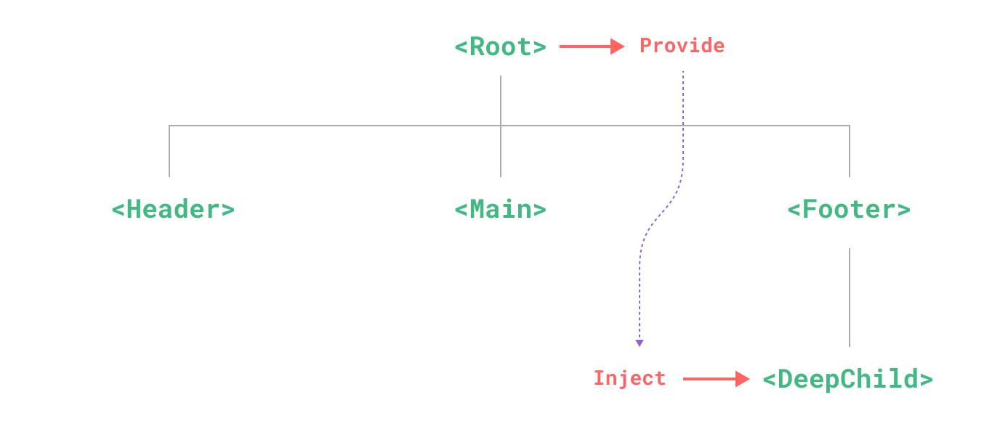

## 컴포넌트 심화 학습
컴포넌트에서 다른 컴포넌트를 사용하는 방법과 컴포넌트 간의 데이터, 이벤트 전달 방법 및 컴포넌트 재활용성을 높여주는 slot을 이용해 일관성 있는 UI를 개발하는 방법에 대해 알아보자.

### import Component

```html
// ~/components/PageTitle.vue

<template>
    <h2>Page Title</h2>
</template>
```
```html
// NestedComponent.vue

<template>
    <div>
        <PageTitle />
    </div>
</template>

<script>
import PageTitle from '~/components/PageTitle.vue';

export default {
    components: { PageTitle },
}
</script>
```

`NesctedComponent.vue` 컴포넌트에서 `PageTitle.vue`를 사용하기 위해 PageTitle 컴포넌트를 `import`하고 `components`에 등록한 후 `template`에서 컴포넌트 이름을 태그처럼 사용하면 된다.

### Props

```html
// ~/components/PageTitle.vue

<template>
    <h2>{{ title }}</h2>
</template>

<script>
export default {
  props: {
    title : {
      type: String,
      default: '페이지 제목입니다.'
    }
  }
}
</script>
```
```html
// NestedComponent.vue

<template>
    <div>
        <PageTitle :title="title"/>
    </div>
</template>

<script>
import PageTitle from '~/components/PageTitle.vue';

export default {
  components: { PageTitle },
  data() {
    return {
      title: '페이지 타이틀 동적으로 전달'
    }
  }
}
</script>
```
`props` 옵션에는 부모 컴포넌트로부터 전달받은 데이터가 저장되고, 부모로부터 전달되지 않았을 때는 default 값을 정의한다.

컴포넌트에서 `props` 옵션을 정의할 때, 전달받는 데이터 타입, 기본 값(default), 필수 여부(required) 그리고 유효성 검사 함수(validator)인 함수를 통해서 유효성을 검사할 수 있다.

```js
export default {
  props: {
    propA: String,
    propB: Number,
    propC: [String, Number],
    propD: {
      type: String,
      required: true
    },
    propE: {
      type: Number,
      default: 100
    },
    propF: {
      type: Object,
      default() {
        return { message: 'hello'}
      }
    },
    propG: {
      validator(value) {
        return ['success', 'warning', 'danger'].includes(value)
      }
    },
    propH: {
      type: Function,
      default() {
        return 'Default function'
      }
    }
  }
}
```

### Component Events

작성중...

### Slots

작성중...

### Provide / inject

일반적으로 부모 컴포넌트에서 자식 컴포넌트로 데이트럴 전달할 때 `props` 옵션을 사용하지만, 계층 구조가 복잡하게 얽혀 있고 깊이 중첩된 자손 컴포넌트에 데이터를 전달하는 경우 데이터를 전달하는 과정이 복잡해지는데, 이것을 Prop Drilling 이라고 한다.

<p style="text-align: center">
    
</p>

Provide / inject를 사용하면 Prop Drilling을 해결할 수 있다.  
컴포넌트의 계층 구조가 아무리 복잡하고 방대해 지더라도 Root 컴포넌트가 모든 하위 컴포넌트에 대해 **dependency provider**역할을 할 수 있고, 하위 트리의 모든 컴포넌트는 깊이에 관계없이 **Root 컴포넌트가 제공(Provide)하는 데이터**를 **주입(Inject)하여 사용**할 수 있다.

<p style="text-align: center">
    
</p>

```
Root
  ├─── Acomponent
  │         ├────── Ccomponent
  │         ├────── Dcomponent
  │         │            └─────── Fcomponent
  │         │                          └─────── Gcomponent
  │         └────── Ecomponent
  └─── Bcomponent
```
모든 자식 컴포넌트에 데이터를 제공하려면 `provide` 옵션을 사용한다.

```html
// Acomponent.vue

<template>
    <Component />
</template>
<script>
import Component from '~/components/Ccomponent.vue';

export default {
    components: { Component },
    data() {
        return {
            message: 'hello'
        }
    },
    provide() {
        return {
            message: this.message
        }
    }
}
</script>
```

`provide` 옵션으로 제공하는 데이터는 값의 변화에 반응형으로 전달되지 못하기 때문에 `computed()` 함수를 사용하여 계산된 속성으로 제공해야 한다.

```js
import { computed } from 'vue';

export default {
    components: { Component },
    data() {
        return {
            message: 'hello'
        }
    },
    provide() {
        return {
            message: computed(() => this.message)
        }
    }
}
```

※ 컴포넌트 관계에서 데이터를 제공하는 것 외에도 앱 수준에서 제공할 수 도 있다.
```js
// main.js
import { createApp } from 'vue';

const app = createApp();
app.provide('message', 'hello world!')
```

`provide` 옵션으로 제공되는 데이터는 `inject` 옵션을 사용해서 사용할 수 있고, 사용법은 `props` 옵션과 비슷하다. 

```html
// Gcomponent.vue
<template>
    <p>{{ message }}</p>
</template>
<script>
export default {
    inject: {
        message: {
            from: 'message',
            default: 'default message'
        }
    }
}
</script>
```

`inject` 옵션은 제공되는 `key` 가 아닌 컴포넌트 내부에서 새로운 `key`를 지정하여 사용할 수 있다. 또한, 컴포넌트 생성 시 `data()` 보다 읽기 때문에 `data()` 에서 접근하여 사용할 수도 있다. 

```js
export default {
    inject: {
        componentMessage: {
            from: 'message',
            default: 'default message'
        }
    },
    data() {
        return {
            fullMessage: this.componentMessage
        }
    }
}
```

`provide` 옵션과 `inject` 옵션을 사용해서 데이터의 전달과 사용을 쉽게 할 수 있지만, 어느 조상 컴포넌트에서 제공하고 있는지 확인이 안된다는 단점도 가지고 있다.

### Template refs

Vue의 선언적 렌더링 모델이 대부분의 DOM 작업을 추상화하지만, 필요한 상황에 따라 DOM 요소에 직접 접근해서 작업해야 하는 경우 `ref` 속성을 사용할 수 있다.

```html

<template>
    <input ref="input" />
</template>
<script>
export default {
    mounted() {
        this.$refs.input.focus();
    }
}
</script>
```

`$refs`는 Vue 라이프사이클에서 컴포넌트 `template` 가 렌더링 된 이후인 `mounted()` 에서 접근할 수 있다.  
`mounted()` 이전에 접근하려고 하면 요소가 존재 하지 않기 때문에 `null` 이다.
