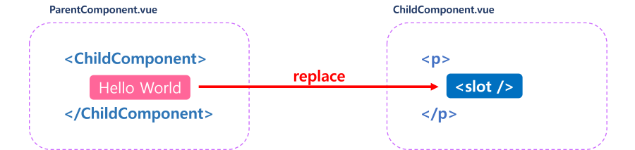
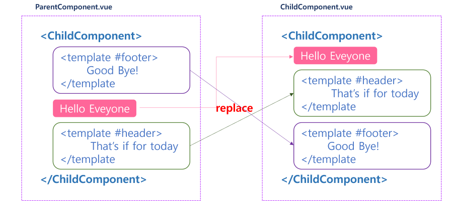

## 컴포넌트 심화 학습
컴포넌트에서 다른 컴포넌트를 사용하는 방법과 컴포넌트 간의 데이터, 이벤트 전달 방법 및 컴포넌트 재활용성을 높여주는 slot을 이용해 일관성 있는 UI를 개발하는 방법에 대해 알아보자.

### import Component

```html
// ~/components/PageTitle.vue

<template>
    <h2>Page Title</h2>
</template>
```
```html
// NestedComponent.vue

<template>
    <div>
        <PageTitle />
    </div>
</template>

<script>
import PageTitle from '~/components/PageTitle.vue';

export default {
    components: { PageTitle },
}
</script>
```

`NesctedComponent.vue` 컴포넌트에서 `PageTitle.vue`를 사용하기 위해 PageTitle 컴포넌트를 `import` 하고 `components`에 등록한 후 `template`에서 컴포넌트 이름을 태그처럼 사용하면 된다.

### Props

`props` 옵션에는 부모 컴포넌트로부터 전달받은 데이터가 저장되고, 부모로부터 전달되지 않았을 때는 default 값을 정의한다.
```html
// ~/components/PageTitle.vue

<template>
    <h2>{{ title }}</h2>
</template>

<script>
export default {
  props: {
    title : {
      type: String,
      default: '페이지 제목입니다.'
    }
  }
}
</script>
```
```html
// NestedComponent.vue

<template>
    <div>
        <PageTitle :title="title"/>
    </div>
</template>

<script>
import PageTitle from '~/components/PageTitle.vue';

export default {
  components: { PageTitle },
  data() {
    return {
      title: '페이지 타이틀 동적으로 전달'
    }
  }
}
</script>
```
<br />
컴포넌트에서 `props` 옵션을 정의할 때, 전달받는 데이터 타입, 기본 값(default), 필수 여부(required) 그리고 유효성 검사 함수(validator)인 함수를 통해서 유효성을 검사할 수 있다.

```js
export default {
  props: {
    propA: String,
    propB: Number,
    propC: [String, Number],
    propD: {
      type: String,
      required: true
    },
    propE: {
      type: Number,
      default: 100
    },
    propF: {
      type: Object,
      default() {
        return { message: 'hello'}
      }
    },
    propG: {
      validator(value) {
        return ['success', 'warning', 'danger'].includes(value)
      }
    },
    propH: {
      type: Function,
      default() {
        return 'Default function'
      }
    }
  }
}
```

### Component Events

부모 컴포넌트와 자식 컴포넌트 간의 이벤트 발생 및 수신은 `v-on`의 내장 메소드 `$emit`을 사용한다.

```html
// ChildComponent.vue

<template>
    <button @click="$emit('childSubmit')"></button>
</template>

<script>
export default {
    methods: {
        submit() {
            this.$emit('childSubmit', value);
        }
    }
}
</script>
```
```html
// ParentComponent.vue

<template>
    <ChildComponent @child-submit="onEmit"/>
</template>

<script>
import ChildComponent from '~/components/ChildComponent.vue'
export default {
    components: { ChildComponent },
    methods: {
        onEmit(value) {
            console.log(value)
        }
    }
}
</script>
```

자식 컴포넌트에서 `$emit`에 이벤트 이름과 데이터를 담아서 부모 컴포넌트로 전달하고, 부모 컴포넌트는 자식 컴포넌트에서 정의한 이벤트를 수신함으로서 전달받은 데이터를 사용할 수 있다. 이것은 `v-model`이 동작하는 방식과 비슷하다.

```html
<input v-model="inputText" />

<input
    :value="inputText"
    @input="inputText = $event.target.value"
/>
```

두 코드는 동일한 작업을 수행한다.  
`v-model`을 특정 컴포넌트에 바인딩 해서 사용하게 되면 부모, 자식 컴포넌트 사이의 이벤트 발생, 수신과 동일한 것이다.

```html
// ChildComponent.vue

<template>
    <input
        :value="modelValue"
        @input="$emit('update:modelValue', $event.target.value)"
    />
</template>
<script>
export default {
    props: ['modelValue'],
    emits: ['update:modelValue']
}
</script>
```
```html
// ParentComponent.vue

<template>
    <ChildComponent v-model="inputText"/>
</template>

<script>
import ChildComponent from '~/components/ChildComponent.vue'
export default {
    components: { ChildComponent },
    data() {
        return {
            inputText: ''
        }
    }
}
</script>
```

### Slots

부모 컴포넌트에서 자식 컴포넌트로 `props`를 통해 데이터를 전달하는 것과 비슷하게, 자식 컴포넌트가 부모 컴포넌트로부터 템플릿 콘텐츠 또는 컴포넌트를 전달받는 방식으로 컴포넌트의 재활용성을 높여주는 기능이다.

```html
// ParentComponent

<template>
    <ChildComponent>
        Hello World
    </ChildComponent>
</template>
```
```html
// ChildComponent

<template>
    <p>
        <slot />
    </p>
</template>
```
```html
// result

<body>
    <div id="app">
        <p>
            Hello World
        </p>        
    </div>
</body>
```
 
<p style="margin: 0 auto"></p>

자식 컴포넌트는 `<slot />`을 사용해서 부모 컴포넌트로부터 전달받을 템플릿 콘텐츠나 컴포넌트의 위치를 만들어서 UI 표현을 할 수 있다.

이름을 지정해서 위치를 명확히 할 수도 있다.
```html
// ParentComponent

<template>
    <ChildComponent>
        <template #footer>
            Good Bye!
        </template>
        Hello Everyone<br />
        <template #header>
            That's if for today<br />
        </template>
    </ChildComponent>
</template>
```
```html
// ChildComponent

<template>
    <p>
        <slot />
        <slot name="header" />
        <slot name="footer" />
    </p>
</template>
```
```html
// result

<body>
    <div id="app">
        <p>
            Hello Everyone
            That's if for today
            Good Bye
        </p>        
    </div>
</body>
```

<p style="text-align: center">
    
</p>

이름을 갖고 있는 `slot`은 부모 컴포넌트에서 `<template #name>...</template>`태그로 감싸서 자식 컴포넌트로 전달한다.

### Provide / inject

일반적으로 부모 컴포넌트에서 자식 컴포넌트로 데이트럴 전달할 때 `props` 옵션을 사용하지만, 계층 구조가 복잡하게 얽혀 있고 깊이 중첩된 자손 컴포넌트에 데이터를 전달하는 경우 데이터를 전달하는 과정이 복잡해지는데, 이것을 Prop Drilling이라고 한다.

<p style="text-align: center">
    
</p>

Provide / inject를 사용하면 Prop Drilling을 해결할 수 있다.  
컴포넌트의 계층 구조가 아무리 복잡하고 방대해지더라도 Root 컴포넌트가 모든 하위 컴포넌트에 대해 **dependency provider** 역할을 할 수 있고, 하위 트리의 모든 컴포넌트는 깊이에 관계없이 **Root 컴포넌트가 제공(Provide) 하는 데이터**를 **주입(Inject) 하여 사용**할 수 있다.

<p style="text-align: center">
    
</p>

```
Root
  ├─── Acomponent
  │         ├────── Ccomponent
  │         ├────── Dcomponent
  │         │            └─────── Fcomponent
  │         │                          └─────── Gcomponent
  │         └────── Ecomponent
  └─── Bcomponent
```
모든 자식 컴포넌트에 데이터를 제공하려면 `provide` 옵션을 사용한다.

```html
// Acomponent.vue

<template>
    <Component />
</template>
<script>
import Component from '~/components/Ccomponent.vue';

export default {
    components: { Component },
    data() {
        return {
            message: 'hello'
        }
    },
    provide() {
        return {
            message: this.message
        }
    }
}
</script>
```

`provide` 옵션으로 제공하는 데이터는 값의 변화에 반응형으로 전달되지 못하기 때문에 `computed()` 함수를 사용하여 계산된 속성으로 제공해야 한다.

```js
import { computed } from 'vue';

export default {
    components: { Component },
    data() {
        return {
            message: 'hello'
        }
    },
    provide() {
        return {
            message: computed(() => this.message)
        }
    }
}
```

※ 컴포넌트 관계에서 데이터를 제공하는 것 외에도 앱 수준(global)에서 제공할 수도 있다.
```js
// main.js
import { createApp } from 'vue';

const app = createApp();
app.provide('message', 'hello world!')
```

`provide` 옵션으로 제공되는 데이터는 `inject` 옵션을 사용해서 사용할 수 있고, 사용법은 `props` 옵션과 비슷하다. 

```html
// Gcomponent.vue
<template>
    <p>{{ message }}</p>
</template>
<script>
export default {
    inject: {
        message: {
            from: 'message',
            default: 'default message'
        }
    }
}
</script>
```

`inject` 옵션은 제공되는 `key` 가 아닌 컴포넌트 내부에서 새로운 `key`를 지정하여 사용할 수 있다. 또한, 컴포넌트 생성 시 `data()` 보다 먼저 읽기 때문에 `data()`에서 접근하여 사용할 수도 있다. 

```js
export default {
    inject: {
        componentMessage: {
            from: 'message',
            default: 'default message'
        }
    },
    data() {
        return {
            fullMessage: this.componentMessage
        }
    }
}
```

`provide` 옵션과 `inject` 옵션을 사용해서 데이터의 전달과 사용을 쉽게 할 수 있지만, 어느 조상 컴포넌트에서 제공하고 있는지 확인이 안된다는 단점도 가지고 있다.

### Template refs

Vue의 선언적 렌더링 모델이 대부분의 DOM 작업을 추상화하지만, 필요한 상황에 따라 DOM 요소에 직접 접근해서 작업해야 하는 경우 `ref` 속성을 사용할 수 있다.

```html
<template>
    <input ref="input" />
</template>
<script>
export default {
    mounted() {
        this.$refs.input.focus();
    }
}
</script>
```

`$refs`는 Vue 라이프사이클에서 **컴포넌트 `template` 가 렌더링 된 이후인 `mounted()` 에서 접근**할 수 있다.  
`mounted()` 이전에 접근하려고 하면 요소가 존재 하지 않기 때문에 `null` 이다.  
`ref` 속성은 HTML 태그에서 사용되는 id처럼 유일한 키값을 사용해야 한다.

자식 컴포넌트에 `ref`를 지정하면 부모 컴포넌트에서 `this.$refs.child_component`로 자식 컴포넌트 객체에 접근하여 자식 컴포넌트가 가진 데이터, 함수 등을 직접 핸들링 할 수 있다.

```html
// ChildComponent.vue

<template>
    <button @click="childFunc" ref="btn">{{ msg }}</button>
</template>

<script>
export default {
    data() {
        return {
            msg: '시작 메세지'
        }
    },
    methods: {
        childFunc() {
            this.msg = '새 메세지'
        }
    }
}
</script>
```
```html
// ParentComponent.vue

<template>
    <ChildComponent ref="child_component">{{ msg }}</ChildComponent>
</template>

<script>
import ChildComponent from '~/components/ChildComponent.vue';

export default {
    components: { ChildComponent },
    data() {
        return {
            msg: '시작 메세지'
        }
    },
    computed: {
        childMsg() {
            // 자식 컴포넌트 데이터 동기화
            return this.$refs.child_component.msg;
        }
    }
    mounted() {
        // 자식 컴포넌트 엘리먼트 클릭
        this.$refs.child_component.$refs.btn.click();
        
        // 자식 메소드 실행
        this.$refs.child_component.childFunc();

        // 자식 데이터 변경
        this.$refs.child_component.mgs = '부모가 변경한 메세지';
    }
}
</script>
```
