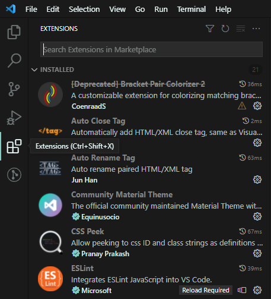
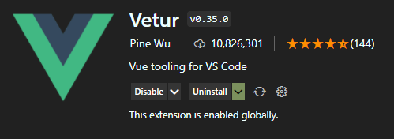
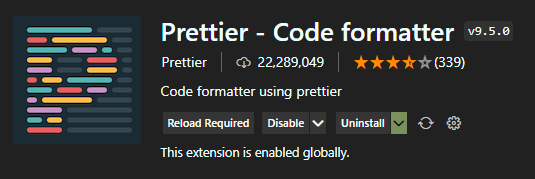

# 개발환경 구성
- 코드 에디터
  - [Web Storm](https://www.jetbrains.com/ko-kr/webstorm/)
  - [Visual Studio Code](https://code.visualstudio.com/)
- Node JS & NPM
  - [다운로드: LTS(Long-term service supports) version](https://nodejs.org/ko/)
  - macOS Homebrew
    - Homebrew 설치 : 터미널에 붙여넣기
        >/bin/bash -c "$(curl -fsSL https://raw.githubusercontent.com/Homebrew/install/HEAD/install.sh)"
    - ```brew install node``` 설치
  - 설치 확인
    ```
    node -v
    npm -v
    
    /*
    * 한번쯤은 -h (help) 옵션을 쳐보는게 좋다.
    */
    ```
- Visual Studio Code 사용시 Extension 설치
  
  - Vetur
    >Vue 프로그램 코드 작성 시 사용할 수 있는 프로그램 문법에 맞는 Syntax Highlighting을 지원하고 문법에 대한 가이드 제공
    
    
  - Prettier
    >지정된 형태로 코드를 포맷

    

# Vue CLI
## 설치 및 프로젝트 생성
- 설치
  >Vue CLI는 Vue 프로젝트를 생성할 때마다 사용해야 하므로 -g(global)로 설치
  ```
  npm install -g @vue/cli
  
  // npm install option
  -g // global 설치, 이 외에는 모두 local 설치
  --save // package.json dependensies에 설치정보 추가
  --save-dev || -D // package.json devDependencies에 설치정보 추가
  ```
- Vue 프로젝트 생성
  ```
  vue create vue-project
  
  // 설치 옵션을 선택하여 설치를 완료
  Vue CLI v5.0.6
  ? Please pick a preset: (Use arrow keys)
  > Default ([Vue 3] babel, eslint)
    Default ([Vue 2] babel, eslint)
    Manually select features
  ```
  >Manually select feature로 설치 시 내가 설정한 설치 옵션을 preset으로 저장해서 향후 vue 프로젝트를 생서할 때 동일한 선택 옵션으로 프로젝트를 생성할 수 있다.
  ```
  Vue CLI v5.0.6
  ? Please pick a preset: Manually select features
  ...
  ? Save this as a preset for future projects? Yes
  ? Save preset as: su preset
  
  // 저장한 preset으로 설치
  vue create vue-project
  
  Vue CLI v5.0.6
  ? Please pick a preset: (Use arrow keys)
  > su preset ([Vue 3] dart-sass, babel, typescript, router, vuex, eslint, unit-jest)
    Default ([Vue 3] babel, eslint)
    Default ([Vue 2] babel, eslint)
    Manually select features
  ```
- Vue 프로젝트 실행
  ```
  cd vue-project
  npm run serve // 기본 포트인 8080(http://localhost:8080/)으로 실행
  
  npm run serve -- --port 3000 // 3000(http://localhost:3000/) 포트로 실행
  ```
## 폴더 / 파일 구조
- node_modules: npm으로 설치된 패키지 파일들이 모이는 곳
- public: 웹팩(webpack)을 통해 관리되지 않는 정적 리소스가 모여 있음
- src: 프로젝트 source
- src/assets: 이미지, css, font 등을 관리 (assets = 자산)
- src/components: Vue 컴포넌트 파일들을 이곳에 위치
  >component? value, methods의 집합  
   module? 1개 이상의 component를 조합한 집합체  
   project? module의 조합
  - *.vue 파일에서 value = <template />, methods = <script />
- src/router: Route 설정 파일이 있음
- src/store: Vuex 상태관리 파일이 있음
- src/view: Route 설정을 통해 전환될 페이지 Root 파일이 모여 있음
- src/App.vue: 프로젝트 Root 컴포넌트
- src/main.ts: 가장 먼저 실행하되는 파일로써, Vue 인스턴스를 생성하는 역할
- tests: 메뉴얼 설치시 테스트 옵션을 선택했을 생성되는 테스트 파일이 모여 있음
- .gitignore: git에 업로드 할 때 제외할 파일, 폴더를 설정하는 파일
- babel.config.json: babel 설정 파일
- package.json: 프로젝트에 필요한 package를 정의하고 관리하는 파일
  - name: 프로젝트의 이름
  - version: 프로젝트의 버전 정보
  - private: true로 설정하면 해당 프로젝트를 npm으로 배포할 수 없다. 개발자가 실수로 해당 프로젝트를 npm에 배포 하더라도 이 옵션이 true로 되어 있으면 배포를 막을 수 있다.
- package-lock.json: 설치된 package의 dependency 정보를 관리하는 파일
- tsconfig.json: 타입스크립트 설정 파일
- vue.config.js: 개발서버를 담당하는 @vue/cli-service에서 자동으로 로딩하는 파일로 vue cli의 환경 설정과 webpack을 설정할 수 있다.
- README.md: 프로젝트 정보를 기록하는 파일
